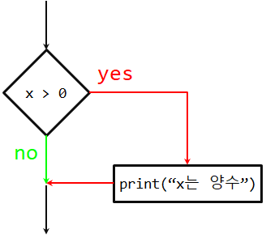
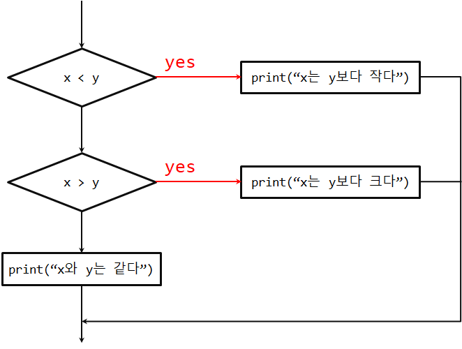
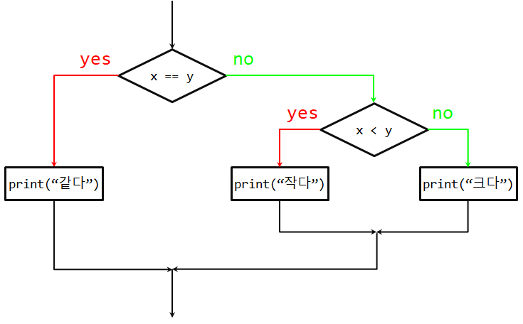

# 조건부 실행 {#r-cont}

## 부울 표현식 {#r-cont-boolean}


**부울 표현식(boolean expression)**은 참(TRUE) 혹은 거짓(FALSE)를 지닌 표현식이다. 
다음 예제는 `==` 연산자를 사용하여 두 개 피연산자를 비교하여 값이 동일하면 참(TRUE), 
그렇지 않으면 거짓(FALSE)을 산출한다.


```r
5 == 5
```

```
## [1] TRUE
```

```r
5 == 6
```

```
## [1] FALSE
```

참(TRUE)과 거짓(FALSE)은 논리형(logical) 자료형(type)에 속하는 특별한 값으로 문자열은 아니다.


```r
typeof(TRUE)
```

```
## [1] "logical"
```

```r
typeof(FALSE)
```

```
## [1] "logical"
```


`==` 연산자는 **비교 연산자(comparison operators)** 중 하나이고, 다른 연산자는 다음과 같다.

- x != y     `#` x는 y와 값이 같지 않다.
- x > y      `#` x는 y보다 크다.
- x < y      `#` x는 y보다 작다.
- x >= y     `#` x는 y보다 크거나 같다.
- x <= y     `#` x는 y보다 작거나 같다.
- x == y     `#` x는 y와 같다.
- x != y     `#` x는 y와 개체가 동일하지 않다.

상기 연산자가 친숙할지 모르지만, R 기호는 수학 기호와 다르다. 
일반적인 오류로 비교를 해서 동일하다는 의미로 `==` 연산자 대신에 `=` 를 사용하는 것이다.
R에서 대입연산자로 `<-`을 사용하지만, `=` 으로 사용해도 프로그램은 돌아간다.
`=` 연산자는 대입 연산자이고, `==` 연산자는 비교 연산자다. 
`=<`, `=>` 같은 비교 연산자는 R에는 없다.


## 논리 연산자 {#r-cont-logical-operator}

세개 **논리 연산자(logical operators)**: `&`, `||`, `!` 이 있다. 
논리 연산자 의미는 수식기호 의미와 유사하다. 
영어로 표현하면 `&`은 `and`, `||`은 `or`, `!`은 `not`이 된다. 예를 들어,

- `x > 0 & x < 10`

x 가 0 보다 크다. 그리고(and), 10 보다 작으면 참이다.

`n % 2 == 0 or n % 3 == 0` 은 두 조건문 중의 하나만 참이 되면, 
즉, 숫자가 2 혹은(`or`) 3으로 나누어지면 참이다.

마지막으로 `!` 연산자는 부울 연산 표현식을 부정한다. 
`x > y` 가 거짓이면, `! (x > y)`은 참이다. 즉, x이 y 보다 작거나 같으면 참이다.

엄밀히 말해서, 논리 연산자의 두 피연산자는 모두 부울 표현식이지만, R에서 그다지 엄격하지는 않다. 
0 이 아닌 임의의 숫자 모두 "참(TRUE)"으로 해석된다.
일반적으로 참(TRUE)이면 `1`, 그렇지 않는 경우 `0`으로 표현해서 사용한다.


```r
17 & TRUE
```

```
## [1] TRUE
```

이러한 유연함이 유용할 수 있으나, 혼란을 줄 수도 있으니 유의해서 사용해야 한다. 
무슨 일을 하고 있는지 정확하게 알지 못한다면 피하는게 상책이다.


## 조건문 실행 {#r-cont-run}

유용한 프로그램을 작성하기 위해서 거의 항상 조건을 확인하고 조건에 따라 프로그램 실행을 바꿀 수 있어야 한다.
**조건문(Conditional statements)**은 그러한 능력을 부여한다. 
가장 간단한 형태는 `if` 문이다.


```r
if (x > 0) {
  print('x 는 양수')
}
```

`if`문 뒤에 불 표현식(boolean expression)을 조건(condition)이라고 한다.

{width=100%}


만약 조건문이 참이면, 첫번째 괄호로 둘러싼 문장이 실행된다. 
만약 조건문이 거짓이면, 첫번째 괄호로 둘러싼 문장의 실행을 건너뛴다.

`if`문은 함수 정의, `for` 반복문과 동일한 구조를 가진다.
`if`문은 `(`으로 시작되고, `)`으로 끝나는 헤더 머리부문과 괄호(`{`, `}`)로 둘러싼 몸통 블록(block)으로 구성된다.
`if`문처럼 문장이 한 줄 이상에 걸쳐 작성되기 때문에 **복합 문장(compound statements)**이라고 한다.

`if`문 몸통 부문에 작성되는 실행 문장 숫자에 제한은 없으나 최소한 한 줄은 있어야 한다.
때때로, 몸통 부문에 어떤 문장도 없는 경우가 있다. 
아직 코드를 작성하지 않아서 자리만 잡아 놓는 경우로, 그냥 놔두면 된다. 즉, 아무것도 작성하지 않고 괄호 내부를 텅비워든다.
파이썬의 경우 아무것도 수행하지 않는 `pass`문을 넣어야 되는 것과 대비된다.


```r
if (x > 0) {
  # 아무것도 작성하지 않고 자리만 잡아둔다. 나중에 코드를 채워넣는다.
}
```

`if`문을 R 인터프리터에서 타이핑하고 엔터를 치게 되면, 
명령 프롬프트가 `+`로 바뀐다. 
따라서 다음과 같이 `if`문 몸통 부분을 작성중에 있다는 것을 나타낸다.


```r
> x <- 3
>
> if (x < 10) {
+ print('작다')
+ }
[1] "작다"
```


## 대안 실행 {#r-cont-alternative}


`if`문의 두 번째 형태는 **대안 실행(alternative execution)**이다.
대안 실행의 경우 두 가지 경우의 수가 존재하고, 조건이 어느 방향으로 실행할 것인지 결정한다. 
구문(Syntax)은 아래와 같다.


```r
if (x %% 2 == 0){
  print("x는 짝수")
} else {
  print("x는 홀수")
}
```

x를 2로 나누었을 때, 0 이되면, x는 짝수이고, 프로그램은 짝수("x는 짝수")라는 결과 메시지를 출력한다. 
만약 조건이 거짓이라면, 두 번째 몸통 부문 문장이 실행된다.

{width=100%}


조건은 참 혹은 거짓이어서, 대안 중 하나만 정확하게 실행된다. 
대안을 **분기(Branch)**라고도 하는데 이유는 실행 흐름이 분기되기 때문이다.


## 연쇄 조건문 {#r-cont-chained}


때때로, 두 가지 이상의 경우의 수가 있으며, 두 가지 이상의 분기가 필요하다.
이와 같은 연산을 표현하는 방식이 **연쇄 조건문(chained conditional)**이다.


```r
if (x < y){
  print("x는 y보다 작다")
} else if (x > y) {
  print("x는 y보다 크다")
} else {
  print("x와 y는 같다")
}
```

"else if"로 연쇄 조건문을 표현하는데 주목한다. 이번에도 단 한번의 분기만 실행된다.

{width = 100%}


`if else` 문의 갯수에 제한은 없다. 
`else` 절이 있다면, 거기서 끝마쳐야 하지만, 연쇄 조건문에 필히 있어야 하는 것은 아니다.


```r
if (choice == 'a') {
  print("Bad guess")
} else if(choice == 'b') {
  print("Good guess")
} else if (choice == 'c') {
  print('Close, but not correct')
}
```


각 조건은 순서대로 점검한다. 만약 첫 번째가 거짓이면, 다음을 점검하고 계속 점검해 나간다.
순서대로 진행 중에 하나의 조건이 참이면, 해당 분기가 수행되고, `if`문 전체는 종료된다. 
설사 하나 이상의 조건이 참이라고 하더라도, 첫 번째 참 분기만 수행된다.

## 중첩 조건문 {#r-cont-nested}

하나의 조건문이 조건문 내부에 중첩될 수 있다. 
다음과 같이 삼분 예제를 작성할 수 있다.


```r
if (x < y){
  print("x는 y보다 작다")
} else {
  if (x > y) {
    print("x는 y보다 크다")
  } else {
    print("x와 y는 같다")
  }
}
```

바깥 조건문에는 두 개의 분기가 있다. 
첫 분기는 간단한 문장을 담고 있다. 
두 번째 분기는 자체가 두 개의 분기를 가지고 있는 또 다른 `if`문을 담고 있다.
자체로 둘다 조건문이지만, 두 분기 모두 간단한 문장이다.

{width = 100%}


괄호를 사용하는 것이 구조를 명확히 하지만, **중첩 조건문의 경우 가독성이 급격히 저하된다. 
일반적으로, 가능하면 중첩 조건문을 피하는 것을 권장한다.**

논리 연산자를 사용하여 중첩 조건문을 간략히 할 수 있다. 
예를 들어, 단일 조건문으로 가지고 앞의 코드를 다음과 같이 재작성할 수 있다.


```r
if (0 < x) {
  if (x < 10) {
    print('x는 한자리 양수.')
  }
}
```


`print`문은 두 개 조건문을 통과될 때만 실행돼서, `&` 연산자와 동일한 효과를 거둘 수 있다.


```r
if (0 < x & x < 10) {
  print("x는 한자리 양수.")
}
```

## try와 catch를 활용한 예외 처리 {#r-cont-try-catch}

함수 `readline()`와 `as.integer()`을 사용하여 앞에서 사용자가 타이핑한 숫자를 읽어 정수로 파싱하는 프로그램 코드를 살펴보았다.
또한 이렇게 코딩하는 것이 얼마나 위험한 것인지도 살펴보았다.


```r
speed <- readline(prompt=prompts)
속도가 얼마나 됩니까? 뭐라고 하셨나요!!!
as.integer(speed) + 5
[1] NA
```

R 인터프리터에서 상기 문장을 실행하면, 
인터프리터에서 새로운 프롬프트로 되고, "이런(oops)" 잠시 후에, 다음 문장 실행으로 넘어간다.

하지만, 만약 코드가 R 스크립트로 실행이 되어 오류가 발생하면,
역추적해서 그 지점에서 즉시 멈추게 된다. 다음에 오는 문장은 실행하지 않는다.

화씨 온도를 섭씨 온도로 변환하는 간단한 프로그램이 있다. 
다소 길이가 긴데, R 콘솔에서 실행하는 코드와 쉘에서 실행할 때 사용자 입력을 받는 것을 달리 처리하기 위함이다. 또한, 한글을 넣게 되면 오류가 발생하니, 프롬프트 메시지는 영어로 처리한다.


```r
# fahrenheit.R
if ( interactive() ){
  inp <- readLines(prompt = "Enter Fahrenheit Temperature: ")
  fahr <- as.numeric(inp)
  cel <- (fahr - 32.0) * 5.0 / 9.0
  print(cel)
} else {
  cat("Enter Fahrenheit Temperature: ")
  inp <- readLines("stdin", n=1)
  fahr <- as.numeric(inp)
  cel <- (fahr - 32.0) * 5.0 / 9.0
  print(cel)
}
```

이 코드를 실행해서 적절하지 않은 입력값을 넣게 되면, 다소 불친절한 오류 메시지와 함께 간단히 작동을 멈춘다.


```r
D:\docs\r4inf\code> Rscript fahrenheit.R
Enter Fahrenheit Temperature: 72
[1] 22.22222

D:\docs\r4inf\code> Rscript fahrenheit.R
Enter Fahrenheit Temperature: fred
[1] NA
():
   NA
```


이런 종류의 예측하거나, 예측하지 못한 오류를 다루기 위해서 R에는 
"try / except"로 불리는 조건 실행 구조가 내장되어 있다.
`try`와 `except`의 기본적인 생각은 일부 명령문에 문제가 있다는 것을 사전에 알고 있고, 
만약 그 때문에 오류가 발생하게 된다면 대신 프로그램에 추가해서 명령문을 실행한다는 것이다. 
`except` 블록의 문장은 오류가 없다면 실행되지 않는다.

문장 실행에 대해서 R `try`, `except` 기능을 보험으로 생각할 수도 있다.

온도 변환기 프로그램을 다음과 같이 재작성한다.


```r
if ( interactive() ){
  inp <- readLines(prompt = "Enter Fahrenheit Temperature: ")
  fahr <- as.numeric(inp)
  cel <- (fahr - 32.0) * 5.0 / 9.0
  print(cel)
} else {
  cat("Enter Fahrenheit Temperature: ")
  inp <- readLines("stdin", n=1)

  tryCatch({
    fahr <- as.numeric(inp)
    cel <- (fahr - 32.0) * 5.0 / 9.0
    print(cel)
  },
  error = function(err) print(paste("ERROR: ", err))
  )
}
```

R은 tryCatch 블록 문장을 우선 실행한다. 
만약 모든 것이 순조롭다면, `error` 블록을 건너뛰고, 다음 코드를 실행한다.
만약 `tryCatch` 블록에서 `error`가 발생하면, 
R은 `tryCatch` 블록에서 빠져 나와 `error` 문장을 수행한다.


`tryCatch`문으로 예외사항을 다루는 것을 예외 처리한다(catching an exception)고 부른다.
예제에서 `error` 절에서는 단순히 오류 메시지를 출력만 한다. 
대체로, 예외 처리를 통해서 오류를 고치거나, 재시작하거나, 최소한 프로그램이 정상적으로 종료될 수 있게 한다.


## 논리 연산식의 단락(Short circuit) 평가 {#r-cont-short-circuit}

`x >= 2 & (x/y) > 2` 와 같은 논리 표현식을 R에서 처리할 때, 왼쪽에서부터 오른쪽으로 표현식을 평가한다.
`&` 정의 때문에 x 가 2보다 작다면, `x >= 2`은 거짓(FALSE)으로, 
전체적으로 `(x/y) > 2` 이 참(TRUE) 혹은 거짓(FALSE) 이냐에 관계없이 거짓(FALSE)이 된다. 

나머지 논리 표현식을 평가해도 나아지는 것이 없다고 R이 자동으로 탐지할 때,
평가를 멈추고 나머지 논리 표현식에 대한 연산도 중지한다. 
최종값이 이미 결정되었기 때문에 더 이상의 논리 표현식의 평가가 멈출 때, 이를 **단락(Short-circuiting) 평가**라고 한다.

좋은 점처럼 보일 수 있지만, 단락 행동은 가디언 패턴(guardian pattern)으로 불리는 좀 더 똑똑한 기술로 연계된다.
R 인터프리터의 다음 코드를 살펴보자.


```r
x <- 6
y <- 2
x >= 2 & (x/y) > 2
```

```
## [1] TRUE
```

```r
x <- 1
y <- 0
x >= 2 & (x/y) > 2
```

```
## [1] FALSE
```

```r
x <- 6
y <- 0
x >= 2 & (x/y) > 2
```

```
## [1] TRUE
```


세번째 연산은 일반적으로 실패하는데 이유는 (x/y) 연산을 평가할 때 y 가 0 이어서 실행오류가 발생된다. 하지만, R에서는 0으로 나누게 되면 `Inf`가 되어 계산결과는 참이 되어 전체적으로 참이 된다.
하지만, 두 번째 예제의 경우 거짓(FALSE)하지 않는데 이유는 x >= 2 이 거짓(FALSE) 으로, 전체가 거짓(FALSE)이 되어 단락(Short-circuiting) 평가 규칙에 의해 (x/y) 평가는 실행되지 않게 된다.

평가 오류를 발생하기 전에 가디언(gardian) 평가식을 전략적으로 배치해서 논리 표현식을 다음과 같이 구성한다. 


```r
x <- 1
y <- 0
x >= 2 & y != 0 & (x/y) > 2
```

```
## [1] FALSE
```

```r
x <- 6
y <- 0
x >= 2 & y != 0 & (x/y) > 2
```

```
## [1] FALSE
```

```r
x >= 2 & (x/y) > 2 & y != 0
```

```
## [1] FALSE
```


첫 번째 논리 표현식은 `x >= 2` 이 거짓(FALSE) 이라 `&`에서 멈춘다.
두 번째 논리 표현식은 `x >= 2` 이 참(TRUE), `y != 0` 은 거짓(FALSE) 이라 `(x/y)`까지 갈 필요가 없다.
세 번째 논리 표현식은 `(x/y)` 연산이 끝난 후에 `y != 0` 이 수행되어서 오류가 발생한다.

두 번째 표현식에서 y 가 0 이 아닐 때만, (x/y)을 실행하도록 `y != 0` 이 가디언(gardian) 역할을 수행한다고 말할 수 있다. 


## 디버깅 {#r-cont-debugging}


오류가 발생했을 때, 파이썬 화면에 출력되는 역추적(traceback)에는 상당한 정보가 담겨있다. 하지만,특히 스택에 많은 프레임이 있는 경우 엄청나게 보여 엄두가 나지 않을 수도 있다. 대체로 가장 유용한 정보는 다음과 같은 것이 있다.


- 어떤 종류의 오류인가.
- 어디서 발생했는가.

구문 오류는 대체로 발견하기 쉽지만, 몇 가지는 애매하다. 파이썬의 경우 공백(space)과 탭(tab)의 차이가 눈에 보이지 않아 통상 무시하고 넘어가기 쉽기 때문에 공백 오류를 잡아내기가 까다롭다. R로 텍스트 데이터를 분석할 경우 눈에는 보이지 않지만 공백문자(White space) 문자가 여러가지 문제를 일으키는 경우가 많다. 특히 한글 인코딩과 결합될 경우 더욱 그렇다.

대체로 오류 메시지는 문제가 어디에서 발견되었는지를 지칭하지만, 실제 오류는 코드 앞에 종종 선행하는 줄에 있을 수 있다.

동일한 문제가 실행 오류에도 있다. 데시벨(decibels)로 신호 대비 잡음비를 계산한다고 가정하자. 공식은 $SNR_{db} = 10 \log_{10} (P_{signal} / P_{noise})$ 이다. 
R에서 아래와 같이 작성할 수 있다.


```r
signal_power <- 9
noise_power <- 10
ratio <- signal_power / noise_power
decibels <- 10 * log10(ratio)
print(decibels)
```


`signal_power` 와 `noise_power` 를 부동 소수점값으로 표현되어 R코드에는 문제가 없지만, 파이썬 2로 실행하게 되면 다음과 같은 오류가 나온다.


```r
Traceback (most recent call last):
File "snr.py", line 5, in ?
decibels = 10 * math.log10(ratio)
OverflowError: math range error
```

오류 메지지가 5번째 줄에 있다고 지칭하지만, 잘못된 것은 없다. 실제 오류를
발견하기위해서,출력값이0인ratio값을print문을사용해서출력하는것이
도움이 된다. 문제는 4번째 줄에 있는데, 왜냐하면 두 정수를 나눌 때 내림 나눗
셈을 했기 때문입니다.

대체로, 오류 메시지는 문제가 어디에서 발견되었는지를 알려주지만, 
종종 문제의 원인이 어디에서 발생했는지는 알려주지 않는다.


## 용어 정의 {#r-cont-terminology}


- 몸통 부문(body)**: 복합 문장 내부에 일련의 문장문
- 부울 표현식(boolean expression)**: 참(TRUE) 혹은 거짓(FALSE)의 값을 가지는 표현식
- 분기(branch)**: 조건문에서 대안 문장의 한 흐름
- 연쇄 조건문(chained conditional)**: 일련의 대안 분기가 있는 조건문
- 비교 연산자(comparison operator)**: 피연산자를 ==, !=, >, <, >=, <=로 비교하는 연산자
- 조건문(conditional statement)**: 조건에 따라 명령의 흐름을 제어하는 명령문
- 조건(condition)**: 조건문에서 어느 분기를 실행할지 결정하는 불 표현식
- 복합문(compound statement)**: 머리부문(head)과 몸통부문(body)으로 구성된 문장. 머리부문은 콜론(:)으로 끝나며, 몸통부문은 머리부문을 기준으로 들여쓰기로 구별된다.
- 가디언 패턴(guardian pattern)**: 단락(short circuit) 행동을 잘 이용하도록 논리 표현식을 구성하는 것
- 논리 연산자(logical operator)**: 불 표현식을 결합하는 연산자 중의 하나 (and, or, not)
- 중첩 조건문(nested conditional)**: 하나의 조건문이 다른 조건문 분기에 나타나는 조건문.
- 역추적(traceback)**: 예외 사항이 발생했을 때 실행되고, 출력되는 함수 리스트
- 단락(short circuit)**: 나머지 표현식 평가를 할 필요없이 최종 결과를 알기 때문에, 파이썬이 논리 표현식 평가를 진행하는 중간에 평가를 멈출 때.


## 연습문제 {#r-cont-ex}

1. 40시간 이상 일할 경우 시급을 1.5배 더 종업원에게 지급하는 봉급계산 프로그램을 다시 작성하세요.


```r
시간을 입력하시오: 35.51
시급을 입력하시오: 7530
알바비: 263550
```

2. `tryCatch`를 사용하여 봉급계산 프로그램을 다시 작성하세요.
숫자가 아닌 입력값을 잘 처리해서 숫자 아닌 입력값이 들어왔을 때 메시지를 출력하고 정상적으로 프로그램을 종료하도록 합니다.
다음이 프로그램 출력 결과를 보여줍니다.


```r
시간을 입력하시오: 35.51
시급을 입력하시오: 칠만원
오류, 다시 숫자를 입력하세요

시급을 입력하시오: 7만원
오류, 다시 숫자를 입력하세요
```


3. 0.0과 1.0 사이의 점수를 출력하는 프로그램을 작성하세요.
만약 점수가 범위 밖이면 오류를 출력합니다. 
만약 점수가 0.0과 1.0 사이라면, 다음의 테이블에 따라 등급을 출력합니다.


```r
점수    등급
>= 0.9   A
>= 0.8   B
>= 0.7   C
>= 0.6   D
< 0.6    F

점수를 입력하시오: 0.95
A

점수를 입력하시오: 만점
올바른 점수가 아닙니다.

점수를 입력하시오: 10.0
올바른 점수가 아닙니다.

점수를 입력하시오: 0.75
C

점수를 입력하시오: 0.5
F
```

4. 상기 보이는 것처럼 반복적으로 프로그램을 실행해서 다양한 다른 입력값을 테스트해 보세요.


