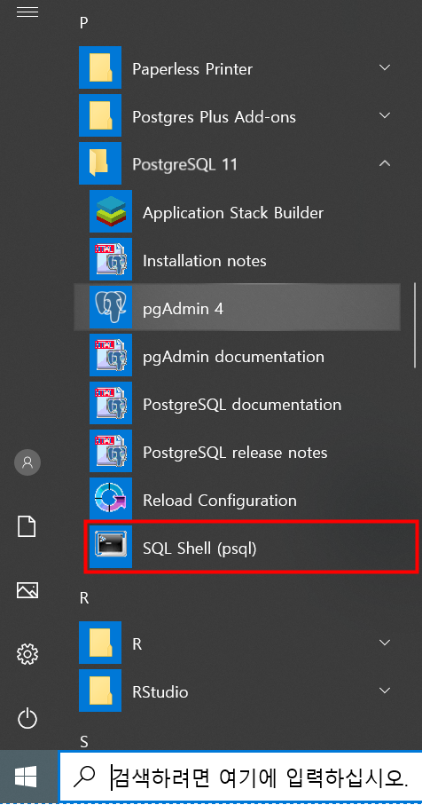
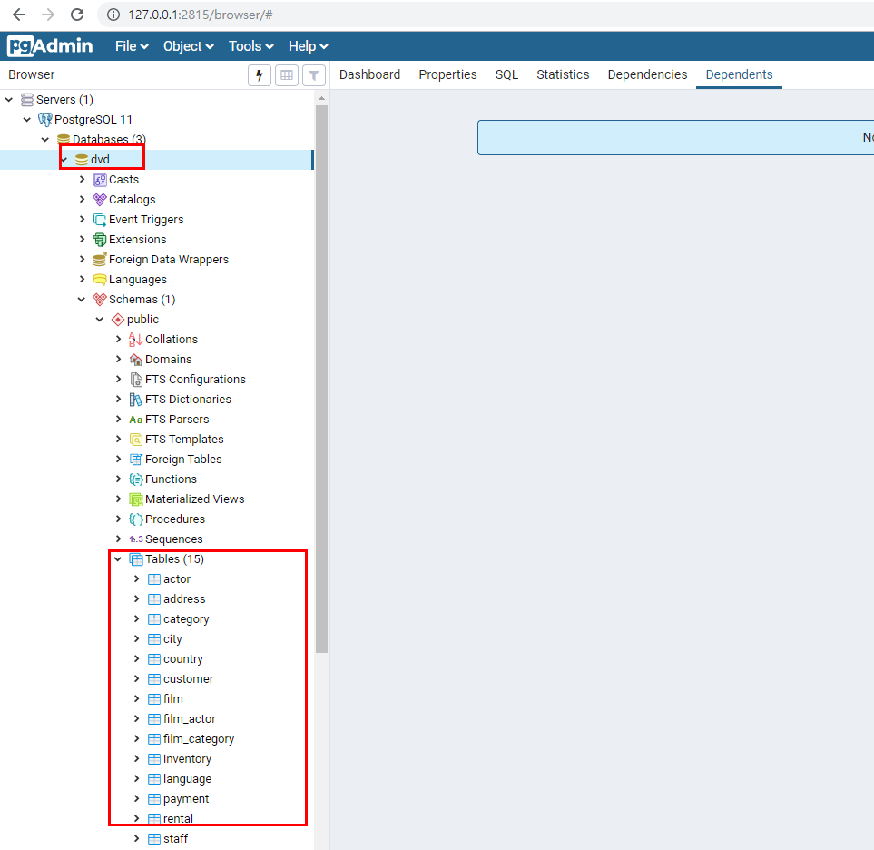
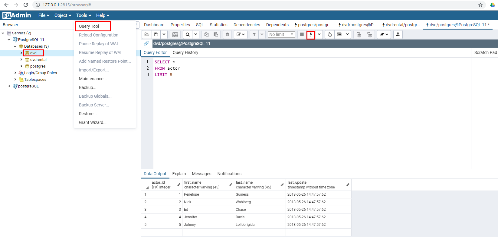
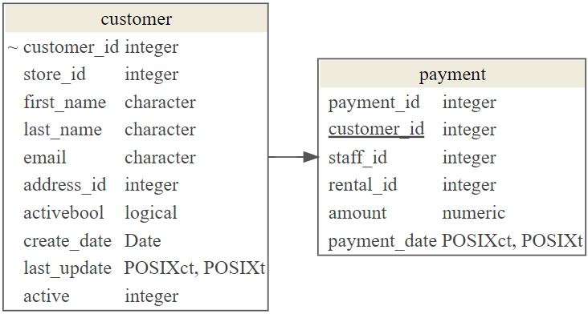
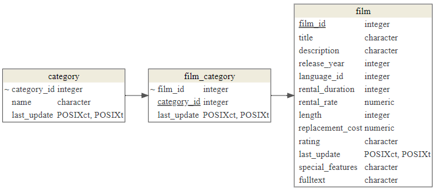
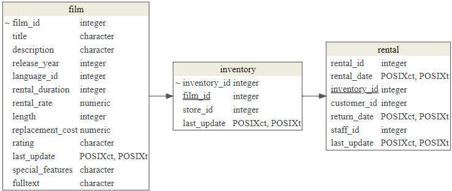

# 데이터베이스와 SQL {#r-db}

## 데이터베이스가 뭔가요? {#r-db-what-it-is}

**데이터베이스(database)**는 데이터를 저장하기 위한 목적으로 조직된 파일이다. 
대부분의 데이터베이스는 **키(key)**와 **값(value)**를 매핑한다는 의미에서 딕셔너리처럼 조직되었다.
가장 큰 차이점은 데이터베이스는 디스크(혹은 다른 영구 저장소)에 위치하고 있어서, 프로그램 종료 후에도 정보가 계속 저장된다.
데이터베이스가 영구 저장소에 저장되어서, 컴퓨터 주기억장치(memory) 크기에 제한받는 딕셔너리보다 훨씬 더 많은 정보를 저장할 수 있다.

딕셔너리처럼, 데이터베이스 소프트웨어는 엄청난 양의 데이터 조차도 매우 빠르게 삽입하고 접근하도록 설계되었다.
컴퓨터가 특정 항목으로 빠르게 찾아갈 수 있도록 데이터베이스에 **인덱스(indexes)**를 추가한다.
데이터베이스 소프트웨어는 인덱스를 구축하여 성능을 보장한다.

다양한 목적에 맞춰 서로 다른 많은 데이터베이스 시스템이 개발되어 사용되고 있다. 
Oracle, MySQL, Microsoft SQL Server, PostgreSQL, SQLite이 여기에 포함된다. 
이 책에서는 SQLite를 집중해서 살펴볼 것이다. 
왜냐하면 매우 일반적인 데이터베이스이며 파이썬에 이미 내장되어 있기 때문이다.
응용프로그램 내부에서 데이터베이스 기능을 제공하도록 SQLite가 다른 응용프로그램 내부에 내장(embedded)되도록 설계되었다.
예를 들어, 다른 많은 소프트웨어 제품이 그렇듯이, 파이어폭스 브라우져도 SQLite를 사용한다.

- [http://sqlite.org/](http://sqlite.org/)

이번 장에서 기술하는 트위터 스파이더링 응용프로그램처럼 정보과학(Informatics)에서 마주치는 몇몇 데이터 조작 문제에 SQLite가 적합하다.

## 데이터베이스 개념 {#r-db-concept}

처음 데이터베이스를 볼때 드는 생각은 마치 엑셀같은 다중 시트를 지닌 스프레드쉬트(spreadsheet)같다는 것이다.
데이터베이스에서 주요 데이터 구조물은 테이블(tables), 행(rows), and 열(columns)이 된다. 

{width=100%}

관계형 데이터베이스의 기술적인 면을 설명하면 테이블, 행, 열의 개념은 
**관계(relation)**, **튜플(tuple)**, **속성(attribute)** 각각 형식적으로 매칭된다.
이번 장에서는 조금 덜 형식 용어를 사용한다.


## 파이어폭스 SQLite 관리자 {#r-db-firefox}

SQLite 데이터베이스 파일에 있는 데이터를 다루기 위해서 이번장에서 주로 R 사용에 집중을 하지만, 
다음 웹사이트에서 무료로 이용 가능한 SQLite 데이터베이스 매니저(SQLite Database Manager)로 불리는 **파이어폭스 애드온(add-on)**을 사용해서 좀더 쉽게 많은 작업을 수행할 수 있다.
파이어폭스 애드온은 크롬 확장 프로그램과 유사한 개념으로 파이어폭스는 
개발자들이 많이 사용하는 웹브라우져 중 하나다.

- [https://addons.mozilla.org/en-us/firefox/addon/sqlite-manager/](https://addons.mozilla.org/en-us/firefox/addon/sqlite-manager/)

브라우져를 사용해서 쉽게 테이블을 생성하고, 데이터를 삽입, 편집하고 데이터베이스 데이터에 대해 간단한 SQL 질의를 실행할 수 있다.

이러한 점에서 데이터베이스 매니저는 텍스트 파일을 작업할 때 사용하는 텍스트 편집기와 유사하다.
텍스트 파일에 하나 혹은 몇개 작업만 수행하고자 하면, 텍스트 편집기에서 파일을 열어 필요한 수정작업을 하고 닫으면 된다.
텍스트 파일에 작업할 사항이 많은 경우는 종종 간단한 R 프로그램을 작성하여 수행한다.
데이터베이스로 작업할 때도 동일한 패턴이 발견된다. 
간단한 작업은 데이터베이스 매니저를 통해서 수행하고,
좀더 복잡한 작업은 R로 수행하는 것이 더 편리하다.


## 데이터베이스 테이블 생성 {#r-db-create-table}

데이터베이스는 R 리스트 혹은 딕셔너리보다 좀더 명확히 정의된 구조를 요구한다. [^db-data-structure]

[^db-data-structure]: 실질적으로 SQLite는 열에 저장되는 데이터 형식에 대해서 좀더 많은 유연성을 부여하지만, 이번 장에서는 데이터 형식을 엄격하게 적용해서 MySQL 같은 다른 관계형 데이터베이스 시스템에도 동일한 개념이 적용되게 한다.


데이터베이스에 테이블(table)을 생성할 때, 열(column)의 명칭과 각 열(column)에 저장하는 테이터 형식을 사전에 정의해야 한다. 
데이터베이스 소프트웨어가 각 열의 데이터 형식을 인식하게 되면, 데이터 형식에 따라 데이터를 저장하고 찾아오는 방법을 가장 효율적인 방식을 선택할 수 있다.

다음 url에서 SQLite에서 지원되는 다양한 데이터 형식을 살펴볼 수 있다.

- [http://www.sqlite.org/datatypes.html](http://www.sqlite.org/datatypes.html)

처음에는 데이터 구조를 사전에 정의하는 것이 불편하게 보이지만, 대용량의 데이터가 데이터베이스에 포함되더라도 데이터의 빠른 접근을 보장하는 잇점이 있다.

데이터베이스 파일과 데이터베이스에 두개의 열을 가진 `Tracks` 이름의 테이블을 생성하는 코드는 다음과 같다.


```r
library(RSQLite)

music_db  <- "data/music.sqlite"
conn <- dbConnect(drv = SQLite(), dbname= music_db)

dbSendQuery(conn, "INSERT INTO Tracks (title, plays) VALUES ( ?, ? )", c('Thunderstruck', 20))
dbSendQuery(conn, "INSERT INTO Tracks (title, plays) VALUES ( ?, ? )", c('My Way', 15))

dbDisconnect(conn)
```


**연결 (connect)** 연산은 현재 디렉토리 `data/music.sqlite3` 파일에 저장된 데이터베이스에 "연결(connection)"한다.
파일이 존재하지 않으면, 자동 생성된다. 
"연결(connection)"이라고 부르는 이유는 때때로 데이터베이스가 응용프로그램이 실행되는 서버로부터 분리된 "데이터베이스 서버(database server)"에 저장되기 때문이다.
지금 간단한 예제 파일의 경우에 데이터베이스가 로컬 파일 형태로 R 코드 
마찬가지로 동일한 디렉토리에 있다.

파일을 다루는 **파일 핸들(file handle)**처럼 데이터베이스에 저장된 파일에 연산을 수행하기 위해서 **커서(cursor)**를 사용한다.
`cursor()`를 호출하는 것은 개념적으로 텍스트 파일을 다룰 때 `readLines()`을 호출하는 것과 개념적으로 매우 유사하다.

{width=100%}

커서가 생성되면, `dbGetQuery()` 함수를 사용하여 데이터베이스 콘텐츠에 명령어 실행을 할 수 있다.

데이터베이스 명령어는 특별한 언어로 표현된다.
단일 데이터베이스 언어를 학습하도록 서로 다른 많은 데이터베이스 업체 사이에서 표준화되었다.

데이터베이스 언어를 **SQL(Structured Query Language 구조적 질의 언어)**로 부른다.

- [http://en.wikipedia.org/wiki/SQL](http://en.wikipedia.org/wiki/SQL)

상기 예제에서, 데이터베이스에 두개의 SQL 명령어를 실행했다. 
관습적으로 데이터베이스 키워드는 대문자로 표기한다.
테이블명이나 열의 명칭처럼 사용자가 추가한 명령어 부분은 소문자로 표기한다.

첫 SQL 명령어는 만약 존재한다면 데이터베이스에서 `Tracks` 테이블을 삭제한다.
동일한 프로그램을 실행해서 오류 없이 반복적으로 `Tracks` 테이블을 생성하도록하는 패턴이다.
`DROP TABLE` 명령어는 데이터베이스 테이블 및 테이블 콘텐츠 전부를 삭제하니 주의한다. (즉, "실행취소(undo)"가 없다.)

```
`dbGetQuery(conn, 'DROP TABLE IF EXISTS Tracks ') `
```

두번째 명령어는 title 문자형 열과 plays 정수형 열을 가진 Tracks으로 명명된 테이블을 생성한다.

```
`dbGetQuery(conn, 'CREATE TABLE Tracks (title TEXT, plays INTEGER)')`
```

이제 Tracks으로 명명된 테이블을 생성했으니, SQL INSERT 연산을 통해 테이블에 
데이터를 넣을 수 있다.
다시 한번, 데이터베이스에 연결하여 커서(cursor)를 얻어 작업을 시작한다. 
그리고 나서 커서를 사용해서 SQL 명령어를 수행한다.

SQL `INSERT` 명령어는 어느 테이블을 사용할지 특정한다.
그리고 나서 `(title, plays)`  포함할 필드 목록과 테이블 새로운 행에 저장될 VALUES 나열해서 신규 행을 정의를 마친다.
실제 값이 `execute()` 호출의 두번째 매개변수로 튜플 `('My Way', 15)` 로 넘겨는 것을 표기하기 위해서 값을 물음표 `(?, ?)`로 명기한다.


```r
library(RSQLite)

music_db  <- "data/music.sqlite"
conn <- dbConnect(drv = SQLite(), dbname= music_db)

dbSendQuery(conn, "INSERT INTO Tracks (title, plays) VALUES ( ?, ? )", 
            c('Thunderstruck', 20))
dbSendQuery(conn, "INSERT INTO Tracks (title, plays) VALUES ( ?, ? )", 
            c('My Way', 15))

print('Tracks:')

dbGetQuery(conn, 'SELECT title, plays FROM Tracks')

dbSendQuery(conn, "DELETE FROM Tracks WHERE plays < 100")

dbDisconnect(conn)
```


먼저 테이블에 두개 열을 삽입(INSERT)하여 데이터를 데이터베이스에 저장되도록 했다.
그리고 나서, `SELECT` 명령어를 사용하여 테이블에 방금 전에 삽입한 행을 불러왔다.
`SELECT` 명령어에서 데이터를 어느 열`(title, plays)`에서, 어느 테이블`Tracks`에서 
가져올지 명세한다. 프로그램 실행결과는 다음과 같다.


```r
> dbGetQuery(conn, 'SELECT title, plays FROM Tracks')
          title plays
1 Thunderstruck    20
2        My Way    15
```


프로그램 마지막에 SQL 명령어를 실행 사용해서 방금전에 생성한 행을 
모두 삭제(`DELETE`)했기 때문에  프로그램을 반복해서 실행할 수 있다. 
삭제(`DELETE`) 명령어는 `WHERE` 문을 사용하여 선택 조건을 표현할 수 있다.
따라서 명령문에 조건을 충족하는 행에만 명령문을 적용한다.
이번 예제에서 기준이 모든 행에 적용되어 테이블에 아무 것도 없게 된다.
따라서 프로그램을 반복적으로 실행할 수 있다.
삭제(DELETE)를 실행한 후에 데이터베이스에서 데이터를 완전히 제거했다.

## SQL 요약 {#r-db-sql}

지금까지, R 예제를 통해서 SQL(Structured Query Language)을 사용했고, 
SQL 명령어에 대한 기본을 다루었다.
이번 장에서는 SQL 언어를 보고 SQL 구문 개요를 살펴본다.

대단히 많은 데이터베이스 업체가 존재하기 때문에 호환성의 문제로 SQL(Structured Query Language)이 표준화되었다.
그래서, 여러 업체가 개발한  데이터베이스 시스템 사이에 호환하는 방식으로 커뮤니케이션 가능하다.

관계형 데이터베이스는 테이블, 행과 열로 구성된다. 
열(column)은 일반적으로 텍스트, 숫자, 혹은 날짜 자료형을 갖는다.
테이블을 생성할 때, 열의 명칭과 자료형을 지정한다.

```
CREATE TABLE Tracks (title TEXT, plays INTEGER)
```

테이블에 행을 삽입하기 위해서 SQL `INSERT` 명령어를 사용한다.

```
INSERT INTO Tracks (title, plays) VALUES ('My Way', 15)
```

`INSERT` 문장은 테이블 이름을 명기한다.
그리고 나서 새로운 행에 놓고자 하는 열/필드 리스트를 명시한다.
그리고 나서 키워드 `VALUES`와 각 필드 별로 해당하는 값을 넣는다.

SQL `SELECT` 명령어는 데이터베이스에서 행과 열을 가져오기 위해 사용된다.
`SELECT` 명령문은 가져오고자 하는 행과 `WHERE`절을 사용하여 어느 행을 가져올지 지정한다.
선택 사항으로 `ORDER BY` 절을 이용하여 반환되는 행을 정렬할 수도 있다.

```
SELECT * FROM Tracks WHERE title = 'My Way'
```

`*` 을 사용하여 `WHERE` 절에 매칭되는 각 행의 모든 열을 데이터베이스에서 가져온다.

주목할 점은 R과 달리 SQL `WHERE` 절은 등식을 시험하기 위해서 두개의 등치 기호 대신에 단일 등치 기호를 사용한다.
WHERE에서 인정되는 다른 논리 연산자는 
`<,>,<=,>=,!=` 이고, 논리 표현식을 생성하는데 `AND`, `OR`, 괄호를 사용한다.

다음과 같이 반환되는 행이 필드값 중 하나에 따라 정렬할 수도 있다.

```
SELECT title,plays FROM Tracks ORDER BY title
```

행을 제거하기 위해서, SQL `DELETE` 문장에 `WHERE` 절이 필요하다.
`WHERE` 절이 어느 행을 삭제할지 결정한다.

```
SELECT title,plays FROM Tracks ORDER BY title
```

다음과 같이 SQL `UPDATE` 문장을 사용해서 테이블에 하나 이상의 행 내에 있는 
하나 이상의 열을 갱신(UPDATE)할 수 있다.

```
UPDATE Tracks SET plays = 16 WHERE title = 'My Way'
```

`UPDATE` 문장은 먼저 테이블을 명시한다.
그리고 나서, `SET` 키워드 다음에 변경할 필드 리스트 와 값을 명시한다.
그리고 선택사항으로 갱신될 행을 `WHERE`절에 지정한다. 
단일 `UPDATE` 문장은 `WHERE`절에서 매칭되는 모든 행을 갱신한다. 
혹은 만약 `WHERE`절이 지정되지 않으면,테이블 모든 행에 대해서 갱신(UPDATE)을 한다.

네가지 기본 SQL 명령문(**INSERT**, **SELECT**, **UPDATE**, **DELETE**)은 
데이터를 생성하고 유지 관리하는데 필요한 기본적인 4가지 작업을 가능케 한다.


## 데이터 모델링 기초 {#r-datamodeling-basics}

관계형 데이터베이스의 진정한 힘은 다중 테이블과 테이블 사이의 관계를
생성할 때 생긴다. 응용프로그램 데이터를 쪼개서 다중 테이블과 두 테이블
간에 관계를 설정하는 것을 **데이터 모델링(data modeling)**이라고 한다.
테이블 정보와 테이블 관계를 표현하는 설계 문서를 
**데이터 모델(data model)**이라고 한다.

데이터 모델링(data modeling)은 상대적으로 고급 기술이여서 이번 장에서는
관계형 데이터 모델링의 가장 기본적인 개념만을 소개한다. 데이터 모델링에
대한 좀더 자세한 사항은 다음 링크에서 시작해 볼 수 있다.

- <http://en.wikipedia.org/wiki/Relational_model>

트위터 스파이더 응용프로그램으로 단순히 한 사람의 친구가 몇명인지 세는
대신에, 모든 관계 리스트를 가지고서 특정 계정에 팔로잉하는 모든 사람을
찾는다.

모두 팔로잉하는 계정을 많이 가지고 있어서, `트위터(Twitter)` 테이블에
단순히 하나의 열만을 추가해서는 해결할 수 없다. 그래서 친구를 짝으로
추적할 수 있는 새로운 테이블을 생성한다. 다음이 간단하게 상기 테이블을
생성하는 방식이다.

```
    CREATE TABLE Pals (from_friend TEXT, to_friend TEXT)
```

`drchuck`을 팔로잉하는 사람을 마주칠 때마다, 다음과 같은 형식의 행을
삽입한다.

```
    INSERT INTO Pals (from_friend,to_friend) VALUES ('drchuck', 'lhawthorn')
```

`drchuck` 트위터 피드에서 친구 20명을 처리하면서, "drchuck"을 첫
매개변수로 가지는 20개 레코드를 삽입해서 데이터베이스에 중복되는 많은
문자열이 생길 것이다.

문자열 데이터 중복은 **데이터베이스 정규화(database normalization)**
모범 사례(berst practice)를 위반하게 만든다. 기본적으로 데이터베이스
정규화는 데이터베이스에 결코 한번 이상 동일한 문자열을 저장하지 않는다.
만약 한번 이상 데이터가 필요하다면, 그 특정 데이터에 대한 숫자
**키(key)**를 생성하고, 그 키를 사용하여 실제 데이터를 참조한다.

실무에서, 문자열이 컴퓨터 주기억장치나 디스크에 저장되는 정수형 자료보다
훨씬 많은 공간을 차지하고 더 많은 처리시간이 비교나 정렬에 소요된다.
항목이 단지 수백개라면, 저장소나 처리 시간이 그다지 문제되지 않는다.
하지만, 데이터베이스에 수백만명의 사람 정보와 1억건 이상의 링크가
있다면, 가능한 빨리 데이터를 스캔하는 것이 정말 중요하다.

앞선 예제에서 사용된 `Twitter` 테이블 대신에 `People`로 명명된 테이블에
트위커 계정을 저장한다. `People` 테이블은 트위터 사용자에 대한 행과
관련된 숫자키를 저장하는 추가 열(column)이 있다. SQLite는 데이터 열의
특별한 자료형(`INTEGER PRIMARY KEY`)을 이용하여 테이블에 삽입할 임의
행에 대해서 자동적으로 키값을 추가하는 기능이 있다.

다음과 같이 추가적인 `id` 열을 가진 `People` 테이블을 생성할 수 있다.

```
    CREATE TABLE People 
        (id INTEGER PRIMARY KEY, name TEXT UNIQUE, retrieved INTEGER)
```

`People` 테이블의 각 행에서 친구 숫자를 더 이상 유지관리하고 있지 않음을
주목하세요. `id` 열 자료형으로 `INTEGER PRIMARY KEY` 선택할 때 함축되는
의미는 다음과 같다., 사용자가 삽입하는 각 행에 대해서 SQLite가 자동으로
유일한 숫자 키를 할당하고 관리하게 한다. `UNIQUE` 키워드를 추가해서
SQLite에 `name`에 동일한 값을 가진 두 행을 삽입하지 못하게 한다.

상기 `Pals` 테이블을 생성하는 대신에, 데이터베이스에 `from_id`, `to_id`
두 정수 자료형 열을 지닌 `Follows` 테이블을 생성한다. `Follows` 테이블은
`from_id`과 `to_id`의 *조합*으로 테이블이 유일하다는 제약사항도 가진다.
(즉, 중복된 행을 삽입할 수 없다.)

```
    CREATE TABLE Follows 
        (from_id INTEGER, to_id INTEGER, UNIQUE(from_id, to_id) )
```

테이블에 `UNIQUE`절을 추가한다는 의미는 레코드를 삽입할 때
데이터베이스에서 지켜야하는 규칙 집합을 의사소통하는 것이다. 잠시 후에
보겠지만, 프로그램상에 편리하게 이러한 규칙을 생성한다. 이러한 규칙
집합은 실수를 방지하게 하고 코드를 작성을 간결하게 한다.

본질적으로 `Follows` 테이블을 생성할 때, "관계(relationship)"를
모델링하여 한 사람이 다른 사람을 "팔로우(follow)"하고 이것을 (a) 사람이
연결되어 있고, (b) 관계을 방향성이 나타나도록 숫자를 짝지어 표현한다.

{width=100%}

### 테이블 제약사항 {#db-constraints}

테이블 구조를 설계할 때, 데이터베이스 시스템에 몇 가지 규칙을 설정할 수
있다. 이러한 규칙은 실수를 방지하고 잘못된 데이터가 테이블에 들어가는
것을 막는다. 테이블을 생성할 때:

```
dbSendQuery( conn, 'CREATE TABLE IF NOT EXISTS People (id INTEGER PRIMARY KEY, name TEXT UNIQUE, retrieved INTEGER)")

dbSendQuery( conn, 'CREATE TABLE IF NOT EXISTS Follows (from_id INTEGER, to_id INTEGER, UNIQUE(from_id, to_id))')
```

`People` 테이블에 `name` 칼럼이 `유일(UNIQUE)`함을 나타낸다. `Follows`
테이블의 각 행에서 두 숫자 조합은 유일하다는 것도 나타낸다. 하나 이상의
동일한 관계를 추가하는 것 같은 실수를 이러한 제약 사항을 통해서
방지한다.

다음 코드에서 이런 제약사항의 장점을 확인할 수 있다.

```
dbSendQuery( conn, 'INSERT OR IGNORE INTO People (name, retrieved) VALUES ( ?, 0)', c( 'friend', ) )
```

`INSERT` 문에 `OR IGNORE` 절을 추가해서 만약 특정 `INSERT`가 "`name`이
유일(unique)해야 한다"를 위반하게 되면, 데이터베이스 시스템은 `INSERT`를
무시한다. 데이터베이스 제약 사항을 안전망으로 사용해서 무언가가 우연히
잘못되지 않게 방지한다.

마찬가지로, 다음 코드는 정확히 동일 `Follows`관계를 두번 추가하지
않는다.

```
dbSendQuery( conn, 'INSERT OR IGNORE INTO Follows (from_id, to_id) VALUES (?, ?)', c(id, friend_id) )
```

다시 한번, `Follows` 행에 대해 지정한 유일한 제약사항을 위반하게 되면
`INSERT` 시도를 무시하도록 데이터베이스에 지시한다.

## 세 종류 키 {#db-three-keys}

지금까지 데이터를 다중 연결된 테이블에 넣고 **키(keys)**를 사용하여 행을
연결하는 방식으로 데이터 모델을 생성했는데, 키와 관련된 몇몇 용어를
살펴볼 필요가 있다. 일반적으로 데이터베이스 모델에서 세가지 종류의 키가
사용된다.

-   **논리 키(logical key)**는 "실제 세상"이 행을 찾기 위해서 사용하는
    키다. 데이터 모델 예제에서, `name` 필드는 논리키다. 사용자에 대해서
    `screen_name`이고, `name` 필드를 사용하여 프로그램에서 여러번 사용자
    행을 찾을 수 있다. 논리 키에 `UNIQUE` 제약 사항을 추가하는 것이
    의미있다는 것을 종종 이해하게 된다. 논리 키는 어떻게 바깥 세상에서
    행을 찾는지 다루기 때문에, 테이블에 동일한 값을 가진 다중 행이
    존재한다는 것은 의미가 없다.

-   **주키(primary key)**는 통상적으로 데이터베이스에서 자동 대입되는
    숫자다. 프로그램 밖에서는 일반적으로 의미가 없고, 단지 서로 다른
    테이블에서 행을 열결할 때만 사용된다. 테이블에 행을 찾을 때,
    통상적으로 주키를 사용해서 행을 찾는 것이 가장 빠르게 행을 찾는
    방법이다. 주키는 정수형이어서, 매우 적은 저장공간을 차지하고 매우
    빨리 비교 혹은 정렬할 수 있다. 이번에 사용된 데이터 모델에서 `id`
    필드가 주키의 한 예가 된다.

-   **외부 키(foreign key)**는 일반적으로 다른 테이블에 연관된 행의
    주키를 가리키는 숫자다. 이번에 사용된 데이터 모델의 외부 키의 사례는
    `from_id`다.

주키 `id`필드명을 호출하고, 항상 외부키에 임의 필드명에 접미사로 `_id`
붙이는 명명규칙을 사용한다.

## DVD 대여 데이터베이스 {#dvd-rental}

### PostgreSQL [^postgreSQL] [^postgreSQL-D2] {#about-postgreSQL}

[^postgreSQL]: [위키백과, "PostgreSQL"](https://ko.wikipedia.org/wiki/PostgreSQL)

[^postgreSQL-D2]: [NAVER D2 한눈에 살펴보는 PostgreSQL](https://d2.naver.com/helloworld/227936)

PostgreSQL은 확장 가능성 및 표준 준수를 강조하는 객체-관계형 데이터베이스 관리 시스템(ORDBMS)의 하나로 BSD 라이선스로 배포되며 오픈소스 개발자 및 관련 회사들이 개발에 참여하고 있다. 소규모의 단일 머신 애플리케이션에서부터 수많은 동시 접속 사용자가 있는 대형의 인터넷 애플리케이션(또는 데이터 웨어하우스용)에 이르기까지 여러 부하를 관리할 수 있으며 macOS 서버의 경우 PostgreSQL은 기본 데이터베이스로 상용 오라클 데이터베이스를 대체하는 오픈소스 데이터베이스로 알려져 있다.

### PostgreSQL 설치 [^install-postgreSQL] {#install-postgreSQL}

[^install-postgreSQL]: [Install PostgreSQL](http://www.postgresqltutorial.com/install-postgresql/)

[PostgreSQL: The World's Most Advanced Open Source Relational Database](https://www.postgresql.org/) 웹사이트에서 
PostgreSQL [다운로드](https://www.postgresql.org/download/windows/) 한다. 윈도우에 설치하는 경우 다음을 참고한다. 설치과정에서 나중에 도움이 될만한 정보는 다음과 같다.

- 설치 디렉토리: `C:\Program Files\PostgreSQL\11`
- 포트: `5432`
- 사용자명: `postgres`

{width=100%}


`PostgreSQL 11` &rarr; `SQL Shell (psql)`을 클릭한 후에 postgreSQL 헬로월드를 찍어본다.
설치과정에서 등록한 비번만 넣어주고 나머지는 로컬호스트와 
기본 디폴트 설정된 데이터베이스를 사용할 것이라 `postgres` 사용자 비밀번호만 넣어준다. 
그리고 나서 `postgre=#` 쉘에 `SELECT version()` 명령어를 넣어준다.

{width=100%}


### 예제 데이터베이스 - `pagila` [^postgreSQL-tutorial] {#install-dvd-postgreSQL}

[^postgreSQL-tutorial]: [PostgreSQL Sample Database](http://www.postgresqltutorial.com/postgresql-sample-database/)

[PostgreSQL Sample Database](https://github.com/devrimgunduz/pagila)를 Github에서 구해서 설치하거나, [PostgreSQL Sample Database](http://www.postgresqltutorial.com/postgresql-sample-database/), [Load PostgreSQL Sample Database](http://www.postgresqltutorial.com/load-postgresql-sample-database/)을 참조하여 DVD 대여 데이터베이스를 설치한다.

1. `SQL Shell (psql)` 쉘을 실행하여 `dvd` 데이터베이스를 생성한다.


```r
Database [postgres]:
Port [5432]:
Username [postgres]:
postgres 사용자의 암호:
psql (11.5)
도움말을 보려면 "help"를 입력하십시오.

postgres=# CREATE DATABASE dvd;
CREATE DATABASE
```

2. `Windows + R` 단축키를 실행시켜 `cmd`를 입력하여 윈도우 쉘을 구동시킨다. 그리고 `postgreSQL`을 설치한 윈도우 디렉토리로 이동한다. `C:\Program Files\PostgreSQL\11\bin` 디렉토리가 된다. 그리고 나서 다운받은 `dvdrental.zip` 파일 압축을 풀어 `dvdrental.tar`을 지정한다.

- `pg_restore` 명령어는 데이터베이스를 생성시키는 역할을 한다.
- `-U postgres` 인자는 사용자를 지정한다.
- `-d dvd` 인자는 데이터베이스를 지정한다.
- `C:\dvdrental\dvdrental.tar` 인자는 파일로 저장된 데이터베이스 정보를 담고 있다.


```r
C:\Program Files\PostgreSQL\11\bin> pg_restore -U postgres -d dvd C:\dvdrental\dvdrental.tar
암호:
C:\Program Files\PostgreSQL\11\bin>
```

{width=100%}


### DVD 대여 질의문 작성 [^connect-sql] {#query-dvd-postgreSQL}

[^connect-sql]: [Connect To a PostgreSQL Database Server](http://www.postgresqltutorial.com/connect-to-postgresql-database/)

`dvd` 데이터베이스가 설치되었기 때문에 쿼리를 던지기 위해서는 postgreSQL 데이터베이스에 접속을 해야한다. 이를 위해서 `pgAdmin 4`를 실행시키게 되면 웹브라우져에 웹인터페이스가 생기게 된다. 데이터베이스를 `dvd`로 지정하고 하고 나서, `Tools` &rarr; `Query Tool`을 클릭하게 되면 해당 데이터베이스 테이블에 쿼리를 던질 수가 있게 된다.

{width=100%}

#### 데이터베이스 사용자 추가 {#database-user}

`postgres` 사용자는 이미 존재하기 때문에 별도로 `tidyverse` 사용자를 추가하고 
권한을 부여한다. `\du` 명령어로 사용자가 정상 등록되었는지 확인한다.


```r
postgres=# create user tidyverse with encrypted password '1234';
CREATE ROLE
postgres=# grant all privileges on database dvd to tidyverse;
GRANT
postgres=# \du
                                 롤 목록
  롤 이름  |                      속성                      | 소속 그룹:
-----------+------------------------------------------------+------------
 postgres  | 슈퍼유저, 롤 만들기, DB 만들기, 복제, RLS 통과 | {}
 tidyverse |                                                | {}
```


#### R에서 postgreSQL 연결 {#rstudio-dvd-postgreSQL}

`postgreSQL` DBMS 내부에 `dvd` 데이터베이스가 생성되었다. 이를 R에서 작업하기 위해서 
`RPostgreSQL`, `DBI` 팩키지를 도입한다. 
`dbConnect()` 함수에 데이터베이스와 연결에 필요한 모든 정보를 저장시킨다. 
그리고 나서 `dbGetQuery()` 함수로 쿼리를 던져 원하는 결과를 받아온다.


```r
library(DBI)
library(RPostgres)

con <- dbConnect(RPostgres::Postgres(), dbname="dvd", 
                 host="localhost",
                 port="5432", 
                 user="postgres", 
                 password="1234")

actor <- dbGetQuery(con, "SELECT * FROM actor LIMIT 5")

DBI::dbDisconnect(con)
```

`dbGetQuery()`로 가져온 데이터프레임을 `dplyr` 동사로 후속작업을 진행한다.


```r
library(tidyverse)

actor %>% 
  filter(actor_id ==1)
```

```
  actor_id first_name last_name         last_update
1        1   Penelope   Guiness 2013-05-26 14:47:57
```

#### 작업에 필요한 테이블 찾기 {#find-table}

데이터베이스에서 쿼리 작업을 수행할 때 가장 먼저 해야 되는 일중의 하나가 적합한 테이블을 찾는 것이다. 이를 위해서 각 DBMS마다 나름대로 정리를 해둔 메타테이블이 존재한다. `postgreSQL`의 경우는 `pg_catalog.pg_tables`가 된다. 가장 많이 사용되는 SQL 데이터베이스별로 동일한 사안에 대해서 찾아보자.

- `postgreSQL`: `SELECT * FROM pg_catalog.pg_tables;`
- sqlite3: `.tables`
- MS `SQL 서버 - Transact-SQL`: `SELECT * FROM INFORMATION_SCHEMA.TABLES;`
- MySQL: `SHOW TABLES;`


```r
qry <- "SELECT *
        FROM pg_catalog.pg_tables"

dbGetQuery(con, qry) %>% 
  filter(schemaname == 'public') 
```

```
   schemaname     tablename tableowner tablespace hasindexes hasrules hastriggers rowsecurity
1      public         actor   postgres       <NA>       TRUE    FALSE        TRUE       FALSE
2      public         store   postgres       <NA>       TRUE    FALSE        TRUE       FALSE
3      public       address   postgres       <NA>       TRUE    FALSE        TRUE       FALSE
4      public      category   postgres       <NA>       TRUE    FALSE        TRUE       FALSE
5      public          city   postgres       <NA>       TRUE    FALSE        TRUE       FALSE
6      public       country   postgres       <NA>       TRUE    FALSE        TRUE       FALSE
7      public      customer   postgres       <NA>       TRUE    FALSE        TRUE       FALSE
8      public    film_actor   postgres       <NA>       TRUE    FALSE        TRUE       FALSE
9      public film_category   postgres       <NA>       TRUE    FALSE        TRUE       FALSE
10     public     inventory   postgres       <NA>       TRUE    FALSE        TRUE       FALSE
11     public      language   postgres       <NA>       TRUE    FALSE        TRUE       FALSE
12     public        rental   postgres       <NA>       TRUE    FALSE        TRUE       FALSE
13     public         staff   postgres       <NA>       TRUE    FALSE        TRUE       FALSE
14     public       payment   postgres       <NA>       TRUE    FALSE        TRUE       FALSE
15     public          film   postgres       <NA>       TRUE    FALSE        TRUE       FALSE
```

#### 테이블 별 칼럼명 {#find-table-columns}

다음으로 테이블을 찾았다고 하면, 해당되는 칼럼명을 찾을 수 있어야 한다. 이를 통해서 유의미한 의미를 찾아낼 수 있는데 칼럼명을 통해 영감을 받아 다가설 수 있게 된다.


```r
col_qry <- "SELECT table_name,
                   STRING_AGG(column_name, ', ') AS columns
            FROM information_schema.columns
            WHERE table_schema = 'public'
            GROUP BY table_name;"

dbGetQuery(con, col_qry) %>% 
  filter(table_name %in% c( "actor", "rental", "store"))
  
DBI::dbDisconnect(con)
```

```
  table_name                                                                               columns
1      actor                                          actor_id, last_update, first_name, last_name
2     rental rental_id, rental_date, inventory_id, customer_id, return_date, staff_id, last_update
3      store                                   store_id, manager_staff_id, address_id, last_update
```

#### DVD ER 다이어그램 {#dvd-er-diagram}

후속 쿼리 분석 작업을 위해서 도움이 되는 ER 다이어그램은 다음과 같다.

{width=100%}

## DVD DB 인사이트 {#dvd-insight-rental}

DVT 대여 데이터베이스를 설치했다면 다음 단계로 다양한 SQL 쿼리문을 던져 뭔가 가치 있는 정보를 추출해야만 한다. [데이터 과학: "postgreSQL - DVD 대여 데이터베이스"](https://statkclee.github.io/data-science/ds-postgreSQL.html)에서 데이터베이스 설치와 접속에 대한 사항은 확인한다.

### DB 접속 헬로월드 [^insight-query] {#dvd-rental-db-insight-sql}

[^insight-query]: [Okoh Anita (2018-12-20), "How I analyzed DVD rental data with SQL", freeCodeCamp](https://www.freecodecamp.org/news/project-1-analyzing-dvd-rentals-with-sql-fd12dd674a64/)

먼저 `DBI::dbConnect()`를 통해 접속하고 SQL 쿼리 헬로월드를 던져보자.


```r
library(RPostgres)

con <- dbConnect(RPostgres::Postgres(), dbname="dvd", 
                 host="localhost",
                 port="5432", 
                 user="postgres", 
                 password="1234")

actor <- dbGetQuery(con, "SELECT * FROM actor LIMIT 5")

actor
```

```
  actor_id first_name    last_name         last_update
1        1   Penelope      Guiness 2013-05-26 14:47:57
2        2       Nick     Wahlberg 2013-05-26 14:47:57
3        3         Ed        Chase 2013-05-26 14:47:57
4        4   Jennifer        Davis 2013-05-26 14:47:57
5        5     Johnny Lollobrigida 2013-05-26 14:47:57
```


### 이탈/잔존고객 구매금액 {#run-statistics-active}

`customer` 테이블에는 `active` 칼럼을 통해 잔존고객과 이탈고객을 파악할 수 있다.
이를 통해서 잔존고객과 이탈고객이 몇명이고 구매금액을 파악할 수 있다. 
먼저 `datamodelr` 팩키지를 통해 해당 테이블을 뽑아내서 이를 시각화해보자.


```r
library(tidyverse)
library(datamodelr)

payment <- tbl(con, "payment") %>% collect()
customer <- tbl(con, "customer") %>% collect()

payment_customer_model <- dm_from_data_frames(payment, customer)

payment_customer_model <- dm_add_references(
  payment_customer_model,
  customer$customer_id ==  payment$customer_id
)

payment_customer_graph <- dm_create_graph(payment_customer_model, rankdir = "LR", col_attr = c("column", "type"))
dm_render_graph(payment_customer_graph)
```


{width=100%}

`con`을 통해 DVD 대여 데이터베이스에 접속이 이루어진 상태다. 
이탈고객과 잔존고객별로 구매금액에 대한 평균, 최소, 최대, 총합계를 구하려면 두 테이블을 `INNER JOIN`으로 `customer_id`를 키값으로 합치고 나서 기술통계를 산출한다.


```r
sql_query <- 
"SELECT active, 
       COUNT(*) AS num_active, 
       MIN(amount) AS min_amt, 
       AVG(amount) AS avg_amt,
       MAX(amount) AS max_amt, 
       SUM(amount) AS total_amt
FROM payment AS p
INNER JOIN customer AS c
  ON p.customer_id = c.customer_id
GROUP BY c.active;"

dbGetQuery(con, sql_query)
```

```
  active num_active min_amt  avg_amt max_amt total_amt
1      0        369    0.99 4.092981   11.99   1510.31
2      1      14227    0.00 4.203397   11.99  59801.73
```

### 쟝르별 평균 대여평점 {#run-statistics-rental-rate}

앞서와 마찬가지로 쟝르별 평균 대여평점을 계산할 수 있는 테이블을 쭉 뽑아본다.
이를 통해서 3개 테이블, 즉 `category`, `film_category`, `film`을 뽑아놓고 각 해당 키값을 사용하여 결합시킨다.


```r
category <- tbl(con, "category") %>% collect()
film_category <- tbl(con, "film_category") %>% collect()
film <- tbl(con, "film") %>% collect()

rental_rating_model <- dm_from_data_frames(category, film_category, film)

rental_rating_model <- dm_add_references(
  rental_rating_model,
  category$category_id == film_category$category_id,
  film_category$film_id == film$film_id
)

rental_rating_graph <- dm_create_graph(rental_rating_model, rankdir = "LR", col_attr = c("column", "type"))
dm_render_graph(rental_rating_graph)
```

{width=100%}


먼저 `film_category`와 `category`를 결합시켜 영화(`film`)가 속한 쟝르(`category`)를 파악한다.


```r
rate_qry <- 
"SELECT * 
FROM category AS c
INNER JOIN film_category AS fc
  ON c.category_id = fc.category_id
LIMIT 5;"

dbGetQuery(con, rate_qry)
```

```
  category_id        name         last_update film_id category_id..5      last_update..6
1           6 Documentary 2006-02-15 09:46:27       1              6 2006-02-15 10:07:09
2          11      Horror 2006-02-15 09:46:27       2             11 2006-02-15 10:07:09
3           6 Documentary 2006-02-15 09:46:27       3              6 2006-02-15 10:07:09
4          11      Horror 2006-02-15 09:46:27       4             11 2006-02-15 10:07:09
5           8      Family 2006-02-15 09:46:27       5              8 2006-02-15 10:07:09
```

다음으로 `film` 테이블을 조인하여 `rental_rate`를 결합하고 
쟝르(`category`) 별로 평균평점을 구하고 이를 `ORDER BY ... DESC`를 사용해서 내림차순으로 정렬한다. 


```r
rate_qry <- 
"SELECT c.name,
        AVG(rental_rate) AS avg_rental_rate
FROM category AS c
INNER JOIN film_category AS fc
  ON c.category_id = fc.category_id 
INNER JOIN film AS f
  ON fc.film_id = f.film_id
GROUP BY c.category_id
ORDER BY avg_rental_rate DESC;"

dbGetQuery(con, rate_qry)
```

```
          name avg_rental_rate
1        Games        3.252295
2       Travel        3.235614
3       Sci-Fi        3.219508
4       Comedy        3.162414
5       Sports        3.125135
6          New        3.116984
7      Foreign        3.099589
8       Horror        3.025714
9        Drama        3.022258
10       Music        2.950784
11    Children        2.890000
12   Animation        2.808182
13      Family        2.758116
14    Classics        2.744386
15 Documentary        2.666471
16      Action        2.646250
```

### Top 10 DVD 영화  {#run-statistics-rental-rate-top10}

가장 많이 대여된 Top 10 DVD 영화를 찾아내기 위해서 이에 해당되는 연관 테이블을 검색하여 찾아낸다. `film`, `inventory`, `rental` 테이블을 특정하고 서로 연결시킬 수 있는 키값을 찾아 연결시킨다.


```r
film <- tbl(con, "film") %>% collect()
inventory <- tbl(con, "inventory") %>% collect()
rental <- tbl(con, "rental") %>% collect()

top_10_model <- dm_from_data_frames(film, inventory, rental)

top_10_model <- dm_add_references(
  top_10_model,
  film$film_id == inventory$film_id,
  inventory$inventory_id == rental$inventory_id
)

top_10_graph <- dm_create_graph(top_10_model, rankdir = "LR", col_attr = c("column", "type"))
dm_render_graph(top_10_graph)
```

{width=100%}

`film` &rarr; `inventory` &rarr; `rental` 테이블을 순차적으로 `film_id`, `inventory_id`를 키값으로 삼아 결합시킨다. 그리고 나서 가장 많이 대여된 영화를 찾기 위해서 `COUNT()` 함수로 개수하고 나서 이를 내림차순 정리한다.


```r
top_query <- 
"SELECT f.title AS movie_title, 
        COUNT(f.title) AS num_rentals
FROM film AS f
INNER JOIN inventory AS i
  ON f.film_id = i.film_id
INNER JOIN rental AS r
  ON i.inventory_id = r.inventory_id
GROUP BY f.title
ORDER BY num_rentals DESC;"

dbGetQuery(con, top_query) %>% 
  slice_max(n=10, order_by = num_rentals)
```

```
           movie_title num_rentals
1   Bucket Brotherhood          34
2     Rocketeer Mother          33
3       Juggler Hardly          32
4  Ridgemont Submarine          32
5        Scalawag Duck          32
6       Grit Clockwork          32
7       Forward Temple          32
8       Timberland Sky          31
9            Zorro Ark          31
10        Robbers Joon          31
11        Hobbit Alien          31
12        Network Peak          31
13       Apache Divine          31
14     Rush Goodfellas          31
15           Wife Turn          31
16   Goodfellas Salute          31
```

## 요약 {#db-summary}

이번 장은 파이썬에서 데이터베이스 사용 기본적인 개요에 대해 폭넓게
다루었다. 데이터를 저장하기 위해서 파이썬 딕셔너리나 일반적인 파일보다
데이터베이스를 사용하여 코드를 작성하는 것이 훨씬 복잡하다. 그래서, 만약
작성하는 응용프로그램이 실질적으로 데이터베이스 역량을 필요하지 않는다면
굳이 데이터베이스를 사용할 이유는 없다. 데이터베이스가 특히 유용한
상황은 (1) 큰 데이터셋에서 작은 임의적인 갱신이 많이 필요한
응용프로그램을 작성할 때 (2) 데이터가 너무 커서 딕셔너리에 담을 수 없고
반복적으로 정보를 검색할 때, (3) 한번 실행에서 다음 실행 때까지 데이터를
보관하고, 멈추고, 재시작하는데 매우 긴 실행 프로세스를 갖는 경우다.

많은 응용프로그램 요구사항을 충족시키기 위해서 단일 테이블로 간단한
데이터베이스를 구축할 수 있다. 하지만, 대부분의 문제는 몇개의 테이블과
서로 다른 테이블간에 행이 연결된 관계를 요구한다. 테이블 사이 연결을
만들 때, 좀더 사려깊은 설계와 데이터베이스의 역량을 가장 잘 사용할 수
있는 데이터베이스 정규화 규칙을 따르는 것이 중요하다. 데이터베이스를
사용하는 주요 동기는 처리할 데이터의 양이 많기 때문에, 데이터를
효과적으로 모델링해서 프로그램이 가능하면 빠르게 실행되게 만드는 것이
중요하다.

## 디버깅 {#db-debugging}

SQLite 데이터베이스에 연결하는 파이썬 프로그램을 개발할 때 하나의
일반적인 패턴은 파이썬 프로그램을 실행하고 SQLite 데이터베이스
브라우저를 통해서 결과를 확인하는 것이다. 브라우저를 통해서 빠르게
프로그램이 정상적으로 작동하는지를 확인할 수 있다.

SQLite에서 두 프로그램이 동시에 동일한 데이터를 변경하지 못하기 때문에
주의가 필요하다. 예를 들어, 브라우저에서 데이터베이스를 열고
데이터베이스에 변경을 하고 "저장(save)"버튼을 누르지 않는다면,
브라우져는 데이터베이스 파일에 "락(lock)"을 걸구, 다른 프로그램이 파일에
접근하는 것을 막는다. 특히, 파일이 잠겨져 있으면 작성하고 있는 파이썬
프로그램이 파일에 접근할 수 없다.

해결책은 데이터베이스가 잠겨져 있어서 파이썬 코드가 작동하지 않는 문제를
피하도록 파이썬에서 데이터베이스에 접근하려 시도하기 전에 데이터베이스
브라우져를 닫거나 혹은 **File** 메뉴를 사용해서 브라우져 데이터베이스를
닫는 것이다.

## 용어정의 {#db-terminology}

- **속성(attribute)**: 튜플 내부에 값의 하나. 좀더 일반적으로 "열", "칼럼", "필드"로
    불린다.
- **제약(constraint)**: 데이터베이스가 테이블의 필드나 행에 규칙을 강제하는 것. 일반적인
    제약은 특정 필드에 중복된 값이 없도록 하는 것(즉, 모든 값이 유일해야
    한다.)
- **커서(cursor)**: 커서를 사용해서 데이터베이스에서 SQL 명령어를 수행하고
    데이터베이스에서 데이터를 가져온다. 커서는 네트워크 연결을 위한
    소켓이나 파일의 파일 핸들러와 유사하다.
- **데이터베이스 브라우져(database browser)**: 프로그램을 작성하지 않고 직접적으로 데이터베이스에 연결하거나 데이터베이스를 조작할 수 있는 소프트웨어.
- **외부 키(foreign key)**: 다른 테이블에 있는 행의 주키를 가리키는 숫자 키. 외부 키는 다른
    테이블에 저장된 행사이에 관계를 설정한다.
- **인텍스(index)**: 테이블에 행이 추가될 때 정보 검색하는 것을 빠르게 하기 위해서
    데이터베이스 소프트웨어가 유지관리하는 추가 데이터.
- **논리 키(logical key)**: "외부 세계"가 특정 행의 정보를 찾기 위해서 사용하는 키. 사용자 계정
    테이블의 예로, 사람의 전자우편 주소는 사용자 데이터에 대한 논리 키의
    좋은 후보자가 될 수 있다.
- **정규화(normalization)**: 어떠한 데이터도 중복이 없도록 데이터 모델을 설계하는 것.
    데이터베이스 한 장소에 데이터 각 항목 정보를 저장하고 외부키를
    이용하여 다른 곳에서 참조한다.
- **주키(primary key)**: 다른 테이블에서 테이블의 한 행을 참조하기 위해서 각 행에 대입되는
    숫자 키. 종종 데이터베이스는 행이 삽입될 때 주키를 자동 삽입하도록
    설정되었다.
- **관계(relation)**: 튜플과 속성을 담고 있는 데이터베이스 내부 영역. 좀더 일반적으로
    "테이블(table)"이라고 한다.
- **튜플(tuple)**:데이터베이스 테이블에 단일 항목으로 속성 집합이다. 좀더 일반적으로
    "행(row)"이라고 한다.


