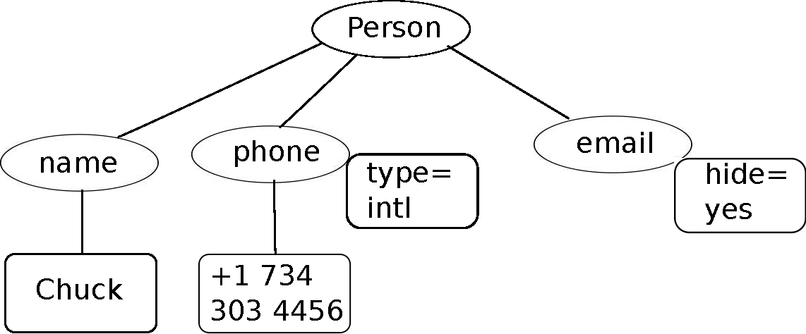
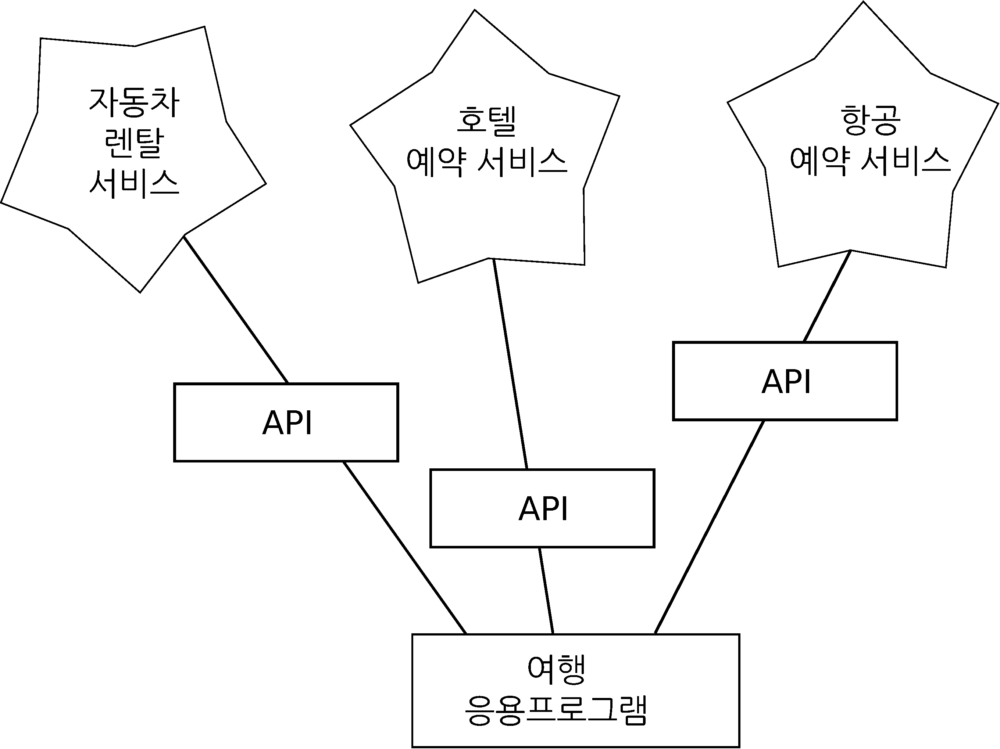

---
output: html_document
editor_options: 
  chunk_output_type: console
---


# 웹서비스 사용하기 {#r-webservice}

프로그램을 사용하여 HTTP상에서 문서를 가져와서 파싱하는 것이 익숙해지면,
다른 프로그램(즉, 브라우져에서 HTML로 보여지지 않는 것)에서 활용되도록
특별히 설계된 문서를 생성하는 것은 그다지 오래 걸리지 않는다.

웹상에서 데이터를 교환할 때 두 가지 형식이 많이 사용된다.
XML("eXtensible Markup Language")은 오랜 기간 사용되어져 왔고
문서-형식(document-style) 데이터를 교환하는데 가장 적합하다. 딕셔너리,
리스트 혹은 다른 내부 정보를 프로그램으로 서로 교환할 때,
JSON(JavaScript Object Notation, [www.json.org](www.json.org))을
사용한다. 두 가지 형식에 대해 모두 살펴볼 것이다.

## XML {#ws-xml}

XML(eXtensible Markup Language)은 HTML과 매우 유사하지만, XML이 좀더 HTML보다 구조화되었다. 여기 XML
문서 샘플이 있다.

```
    <person>
      <name>Chuck</name>
      <phone type="intl">
         +1 734 303 4456
       </phone>
       <email hide="yes"/>
    </person>
```

종종 XML문서를 나무 구조(tree structure)로 생각하는 것이 도움이 된다.
최상단 `person` 태그가 있고, `phone` 같은 다른 태그는 부모 노드의
*자식(children)* 노드로 표현된다.

{width=100%}

## XML 파싱 {#ws-xml-parsing}

다음은 XML을 파싱하고 XML에서 데이터 요소를 추출하는 간단한
응용프로그램이다.


```r
library(xml2)

data <- '
<person>
  <name>Chuck</name>
  <phone type="intl">
     +1 734 303 4456
   </phone>
   <email hide="yes"/>
</person>'

tree <- read_xml(data)

person_name <- xml_find_all(tree, ".//name") %>% 
  xml_text()

person_email <- xml_find_all(tree, ".//email") %>% 
  xml_attr('hide')

cat("Name: ", person_name, "\n",
    "Attr: ", person_email, "\n")
```

`xml2` 패키지 `read_xml()` 함수를 사용하여 XML 문자열 표현을 XML 노드 '나무(tree)'로
변환한다. XML이 나무구조로 되었을 때, XML에서 데이터 일부분을 추출하기
위해서 호출하는 함수가 있다.

`xml_find_all()` 함수는 XML 나무를 훑어서 특정한 태그와 매칭되는 **노드(node)**를
검색한다. 각 노드는 텍스트, 속성(즉, hide 같은), 그리고 "자식(child)"
노드로 구성된다. 각 노드는 노드 나무의 최상단이 될 수 있다.

```
Name:  Chuck 
 Attr:  yes 
```

`xml2`같은 XML 패키지를 사용하는 것은 장점이 있다. 상기 예제의
XML은 매우 간단하지만, 적합한 XML에 관해서 규칙이 많이 있고, XML 구문
규칙에 얽매이지 않고 `xml2`를 사용해서 XML에서 데이터를 추출할 수
있다.

## 노드 반복하기 {#ws-xml-nodes}

종종 XML이 다중 노드를 가지고 있어서 모든 노드를 처리하는 루프를 작성할
필요가 있다. 다음 프로그램에서 모든 `user` 노드를 루프로 반복한다.


```r
library(xml2)

input <- '
    <stuff>
        <users>
            <user x="2">
                <id>001</id>
                <name>Chuck</name>
            </user>
            <user x="7">
                <id>009</id>
                <name>Brent</name>
            </user>
        </users>
    </stuff>'

stuff <- read_xml(input)

lst <- xml_find_all(stuff, "//users/user")

cat("User count:", length(lst), "\n")
```

```
## User count: 2
```

```r
for(i in 1:length(lst)) {
  
  lst_name <- xml_find_all(lst[[i]], ".//name") %>% xml_text()
  lst_id <- xml_find_all(lst[[i]], ".//id") %>% xml_text()
  lst_attr <- xml_attr(lst[[i]], "x")
  
  cat("Name: ", lst_name, "\n")
  cat("Id: ", lst_id, "\n")
  cat("Attribute: ", lst_attr, "\n")
}
```

```
## Name:  Chuck 
## Id:  001 
## Attribute:  2 
## Name:  Brent 
## Id:  009 
## Attribute:  7
```


`xml_find_all()` 함수는는 R 리스트의 하위 나무를 가져온다. 리스트는 XML
나무에서 `user` 구조를 표현한다. 그리고 나서, `for` 루프를 작성해서 각
`user` 노드 값을 확인하고 `name`, `id` 텍스트 요소와 `user` 노드에서 `x`
속성도 가져와서 출력한다.

```
Name:  Chuck 
Id:  001 
Attribute:  2 
Name:  Brent 
Id:  009 
Attribute:  7 
```

## JSON {#webservice-json}

JSON(JavaScript Object Notation) 형식은 자바스크립트 언어에서 사용되는 객체와 
배열 형식에서 영감을 얻었다. 
하지만 파이썬이 자바스크립트 이전에 개발되어서 딕셔너리와
리스트의 파이썬 구문이 JSON 구문에 영향을 주었다. 그래서 JSON 포맷이
거의 파이썬 리스트와 딕셔너리의 조합과 일치한다.

상기 간단한 XML에 대략 상응하는 JSON으로 작성한 것이 다음에 있다.

```
    {
      "name" : "Chuck",
      "phone" : {
        "type" : "intl",
        "number" : "+1 734 303 4456"
       },
       "email" : {
         "hide" : "yes"
       }
    }
```    

몇가지 차이점에 주목하세요. 첫째로 XML에서는 "phone" 태그에 "intl"같은
속성을 추가할 수 있다. JSON 에서는 단지 키-값 페어(key-value pair)다.
또한 XML "person" 태그는 사라지고 외부 중괄호 세트로 대체되었다.

일반적으로 JSON 구조가 XML 보다 간단하다. 왜냐하면, JSON 이 XML보다 적은
역량을 보유하기 때문이다. 하지만 JSON 이 딕셔너리와 리스트의 조합에
*직접* 매핑된다는 장점이 있다. 그리고, 거의 모든 프로그래밍 언어가
파이썬 딕셔너리와 리스트에 상응하는 것을 갖고 있어서, JSON 이 협업하는
두 프로그램 사이에서 데이터를 교환하는 매우 자연스러운 형식이 된다.

XML에 비해서 상대적으로 단순하기 때문에, JSON이 응용프로그램 간 거의
모든 데이터를 교환하는데 있어 빠르게 선택되고 있다.

## JSON 파싱하기 {#webservice-json-parsing}

딕셔너리(객체)와 리스트를 중첩함으로써 JSON을 생성한다. 이번 예제에서,
user 리스트를 표현하는데, 각 user가 키-값 페어(key-value pair, 즉,
딕셔너리)다. 그래서 리스트 딕셔너리가 있다.

다음 프로그램에서 내장된 **json** 라이브러리를 사용하여 JSON을 파싱하여
데이터를 읽어온다. 이것을 상응하는 XML 데이터, 코드와 비교해 보세요.
JSON은 조금 덜 정교해서 사전에 미리 리스트를 가져오고, 리스트가
사용자이고, 각 사용자가 키-값 페어 집합임을 알고 있어야 한다. JSON은
좀더 간략(장점)하고 하지만 좀더 덜 서술적(단점)이다.


```r
library(jsonlite)

input <- '
  [
    { "id" : "001",
      "x" : "2",
      "name" : "Chuck"
    } ,
    { "id" : "009",
      "x" : "7",
      "name" : "Chuck"
    } 
  ]'

input_df <- jsonlite::fromJSON(input)
```


JSON과 XML에서 데이터를 추출하는 코드를 비교하면, `jsonlite` 패키지
`fromJSON()` 함수는 JSON 파일을 즉시 정형 데이터프레임을 변환시킨다.

프로그램 출력은 정확하게 상기 XML 버젼과 동일한 정보를 데이터프레임으로
표현하고 있어 후속 작업에 훨씬 유연하게 대응할 수 있다.


```r
input_df
```

```
##    id x  name
## 1 001 2 Chuck
## 2 009 7 Chuck
```

일반적으로 웹서비스에 대해서 XML에서 JSON으로 옮겨가는 산업 경향이
뚜렷하다. JSON이 프로그래밍 언어에서 이미 갖고 있는 네이티브 자료 구조와
좀더 직접적이며 간단히 매핑되기 때문에, JSON을 사용할 때 파싱하고 데이터
추출하는 코드가 더욱 간단하고 직접적이다. 하지만 XML 이 JSON 보다 좀더
자기 서술적이고 XML 이 강점을 가지는 몇몇 응용프로그램 분야가 있다. 예를
들어, 대부분의 워드 프로세서는 JSON보다는 XML을 사용하여 내부적으로
문서를 저장한다.

## API(응용 프로그램 인터페이스) {#ws-api}

이제 HTTP를 사용하여 응용프로그램간에 데이터를 교환할 수 있게 되었다.
또한, XML 혹은 JSON을 사용하여 응용프로그램간에도 복잡한 데이터를 주고
받을 수 있는 방법을 습득했다.

다음 단계는 상기 학습한 기법을 사용하여 응용프로그램 간에
"계약(contract)"을 정의하고 문서화한다. 응용프로그램-대-응용프로그램
계약에 대한 일반적 명칭은 API **응용 프로그램 인터페이스(Application Program Interface)** 다. 
API를 사용할 때, 일반적으로 하나의 프로그램이
다른 응용 프로그램에서 사용할 수 있는 가능한 서비스 집합을 생성한다.
또한, 다른 프로그램이 서비스에 접근하여 사용할 때 지켜야하는 API (즉, "규칙")도 게시한다.

다른 프로그램에서 제공되는 서비스에 접근을 포함하여 프로그램 기능을
개발할 때, 이러한 개발법을 SOA, **Service-Oriented Architecture(서비스 지향 아키텍처)**라고 부른다. 
SOA 개발 방식은 전반적인 응용 프로그램이 다른 응용 프로그램 서비스를 사용하는 것이다. 
반대로, SOA가 아닌 개발방식은 응용 프로그램이 하나의 독립된 응용 프로그램으로 
구현에 필요한 모든 코드를 담고 있다.

웹을 사용할 때 SOA 사례를 많이 찾아 볼 수 있다. 웹사이트 하나를 방문해서
비행기표, 호텔, 자동차를 단일 사이트에서 예약완료한다. 호텔관련 데이터는
물론 항공사 컴퓨터에 저장되어 있지 않다. 대신에 항공사 컴퓨터는 호텔
컴퓨터와 계약을 맺어 호텔 데이터를 가져와서 사용자에게 보여준다. 항공사
사이트를 통해서 사용자가 호텔 예약을 동의할 경우, 항공사 사이트에서 호텔
시스템의 또다른 웹서비스를 통해서 실제 예약을 한다. 전체
거래(transaction)를 완료하고 카드 결재를 진행할 때, 다른 컴퓨터가
프로세스에 관여하여 처리한다.


{width=100%}

서비스 지향 아키텍쳐는 많은 장점이 있다. (1) 항상 단 하나의 데이터만
유지관리한다. 이중으로 중복 예약을 원치 않는 호텔 같은 경우에 매우
중요하다. (2) 데이터 소유자가 데이터 사용에 대한 규칙을 정한다. 이러한
장점으로, SOA 시스템은 좋은 성능과 사용자 요구를 모두 만족하기 위해서
신중하게 설계되어야 한다.

응응프로그램이 웹상에 이용가능한 API로 서비스 집합을 만들 때,
**웹서비스(web services)**라고 부른다.

## 지오코딩 웹서비스 {#google-geocoding}

구글이 자체적으로 구축한 대용량 지리 정보 데이터베이스를 누구나 이용할
수 있게 하는 훌륭한 웹서비스가 있다. "Ann Arbor, MI" 같은 지리 검색
문자열을 지오코딩 API 에 넣으면, 검색 문자열이 의미하는 지도상에 위치와
근처 주요 지형지물 정보를 나름 최선을 다해서 예측 제공한다.

지오코딩 서비스는 무료지만 사용량이 제한되어 있어서, 상업적
응용프로그램에 API를 무제한 사용할 수는 없다. 하지만, 최종 사용자가
자유형식 입력 박스에 위치정보를 입력하는 설문 데이터가 있다면, 구글
API를 사용하여 데이터를 깔끔하게 정리하는데는 유용하다.

*구글 지오코딩 API 같은 무료 API를 사용할 때, 자원 사용에 대한 지침을
준수해야 한다. 너무나 많은 사람이 서비스를 남용하게 되면, 구글은 무료
서비스를 중단하거나, 상당부분 줄일 수 있다. (When you are using a free
API like Google's geocoding API, you need to be respectful in your use
of these resources. If too many people abuse the service, Google might
drop or significantly curtail its free service.)

서비스에 대해서 자세한 사항을 온라인 문서를 정독할 수 있지만, 무척
간단해서 브라우저에 다음 URL을 입력해서 테스트까지 할 수 있다.

[http://maps.googleapis.com/maps/api/geocode/json?sensor=false &address=Ann+Arbor%2C+MI](http://maps.googleapis.com/maps/api/geocode/json?sensor=false &address=Ann+Arbor%2C+MI)

웹프라우저에 붙여넣기 전에, URL만 뽑아냈고 URL에서 모든 공백을
제거했는지 확인하세요.

다음은 간단한 응용 프로그램이다. 사용자가 검색 문자열을 입력하고 구글
지오코딩 API를 호출하여 반환된 JSON에서 정보를 추출한다.

구글 지리정보 API는 상용으로 전환되었기에 다음카카오 지도 API를 대체하여 
동일한 개발작업을 수행한다.


```r
library(tidyverse)
library(httr)
library(jsonlite)

# usethis::edit_r_environ()

# 주소를 지정합니다. 
kpmg_addr <- '서울특별시 강남구 역삼동 737' 

# HTTP 요청을 실행합니다. 
kpmg_res <- GET(url = 'https://dapi.kakao.com/v2/local/search/address.json',
                query = list(query = kpmg_addr),
                add_headers(Authorization = paste0("KakaoAK ", DAUM_MAP_API_KEY)))

# KPMG 지리정보 데이터프레임
kpmg_list <- kpmg_res %>% 
  content(as = 'text') %>% 
  fromJSON()

## 도로명주소
kpmg_list$documents$road_address %>% 
  select(주소 = address_name, 경도 = x, 위도=y)
```


```r
                      주소             경도             위도
1 서울 강남구 테헤란로 152 127.036508620542 37.5000242405515
```


프로그램이 사용자로부터 검색 문자열을 받는다. 적절히 인코딩된 매개
변수로 검색문자열을 변환하여 URL을 만든다. 그리고 나서 **httr** 패키지를
사용하여 카카오 지오코딩 API에서 텍스트를 가져온다. 고정된 웹페이지와
달리, 반환되는 데이터는 전송한 매개변수와 카카오 서버에 저장된 지리정보
데이터에 따라 달라진다.

JSON 데이터를 가져오면, **jsonlite** 패키지로 파싱하고 전송받은 데이터가
올바른지 확인하는 몇가지 절차를 거친 후에 찾고자 하는 정보를 추출한다.

`Rscript` 프로그램 실행을 위해서 사용자 입력과 API키 외부 유출 방지를 
위한 조치를 취한 후에 일반화를 위해 코드를 일부 수정한다.


```r
library(tidyverse)
library(httr)
library(jsonlite)

# 주소를 지정합니다.

typeline <- function(msg = "주소를 입력하세요 - ") {
  if (interactive() ) {
    url <- readline(msg)
  } else {
    cat(msg);
    url <- readLines("stdin",n=1);
  }
  return(url)
}

address <- typeline() # '서울특별시 강남구 역삼동 737'

# HTTP 요청을 실행합니다.
address_res <- GET(url = 'https://dapi.kakao.com/v2/local/search/address.json',
                query = list(query = address),
                add_headers(Authorization = paste0("KakaoAK ", Sys.getenv("DAUM_MAP_API_KEY"))) )

# 지리정보 데이터프레임 변환
address_list <- address_res %>%
  content(as = 'text') %>%
  fromJSON()

## 도로명주소
address_list$documents$road_address %>%
  select(주소 = address_name, 경도 = x, 위도=y)
```

프로그램 출력결과는 다음과 같다. 

```
$ Rscript script/geocoding.R 

주소를 입력하세요 - '서울특별시 강남구 역삼동 737'
                      주소             경도             위도
1 서울 강남구 테헤란로 152 127.036508620542 37.5000242405515
```

다음카카오 지도 API 외 다른 지오코딩 관련 자세한 사항은 
[공간통계를 위한 데이터 사이언스 - 지리정보 API - 주소와 위도경도](https://statkclee.github.io/spatial/geo-info-lonlat.html) 웹사이트를
참조한다.

## 보안과 API 사용 {#ws-security}

상용업체 API를 사용하기 위해서는 일종의 "API키(API key)"가 일반적으로
필요하다. 서비스 제공자 입장에서 누가 서비스를 사용하고 있으며 각
사용자가 얼마나 사용하고 있는를 알고자 한다. 상용 API 제공업체는
서비스에 대한 무료 사용자와 유료 사용자에 대한 구분을 두고 있다. 특정
기간 동안 한 개인 사용자가 사용할 수 있는 요청수에 대해 제한을 두는
정책을 두고 있다.

때때로 API키를 얻게 되면, API를 호출할 때 POST 데이터의 일부로
포함하거나 URL의 매개변수로 키를 포함시킨다.

또 다른 경우에는 업체가 서비스 요청에 대한 보증을 강화해서 공유키와
비밀번호를 암호화된 메시지 형식으로 보내도록 요구한다. 인터넷을 통해서
서비스 요청을 암호화하는 일반적인 기술을 **OAuth**라고 한다.
<http://www.oauth.net> 사이트에서 OAuth 프로토콜에 대해 더 많은 정보를
만날 수 있다.

트위터 API가 점차적으로 가치있게 됨에 따라 트위터가 공개된 API에서 API를
매번 호출할 때마다 OAuth 인증을 거치도록 API를 바뀌었다. 다행스럽게도
편리한 OAuth 라이브러리가 많이 있다.

그래서 명세서를 읽고 아무것도 없는 상태에서 OAuth 구현하는 것을 필할 수
있게 되었다. 이용 가능한 라이브러리는 복잡성도 다양한만틈 기능적으로도
다양하다. OAuth 웹사이트에서 다양한 OAuth 라이브러리 정보를 확인할 수
있다.

OAuth 보안 요구사항을 충족하기 위해 추가된 다양한 매개 변수 의미를 좀더
자세히 알고자 한다면, OAuth 명세서를 읽어보기 바란다.


이와 같은 보안 API키는 누가 트위터 API를 사용하고 어느 정도 수준으로
트위터를 사용하는지에 대해서 트위트가 확고한 신뢰를 갖게 한다. 사용량에
한계를 두고 서비스를 제공하는 방식은 단순히 개인적인 목적으로 데이터
검색을 할 수는 있지만, 하루에 수백만 API 호출로 데이터를 추출하여 제품을
개발 못하게 제한하는 기능도 동시에 한다.

## 용어정의 {#ws-term}

- **API**: 응용 프로그램 인터페이스(Application Program Interface) - 두 응용
    프로그램 컴포넌트 간에 상호작용하는 패턴을 정의하는 응용 프로그램
    간의 계약.
- **ElementTree**: XML데이터를 파싱하는데 사용되는 파이썬 내장 라이브러리.
- **JSON**: JavaScript Object Notation- 자바스크립트 객체(JavaScript Objects)
    구문을 기반으로 구조화된 데이터 마크업(markup)을 허용하는 형식.
- **REST**: REpresentational State Transfer - HTTP 프로토콜을 사용하여 응용
    프로그램 내부에 자원에 접근을 제공하는 일종의 웹서비스 스타일.
- **SOA**: 서비스 지향 아키텍처(Service Oriented Architecture) - 응용
    프로그램이 네트워크에 연결된 컴포넌트로 구성될 때.
- **XML**: 확장 마크업 언어(eXtensible Markup Language) - 구조화된 데이터의
    마크업을 허용하는 형식.

