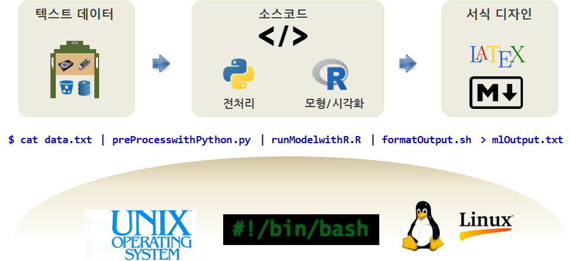
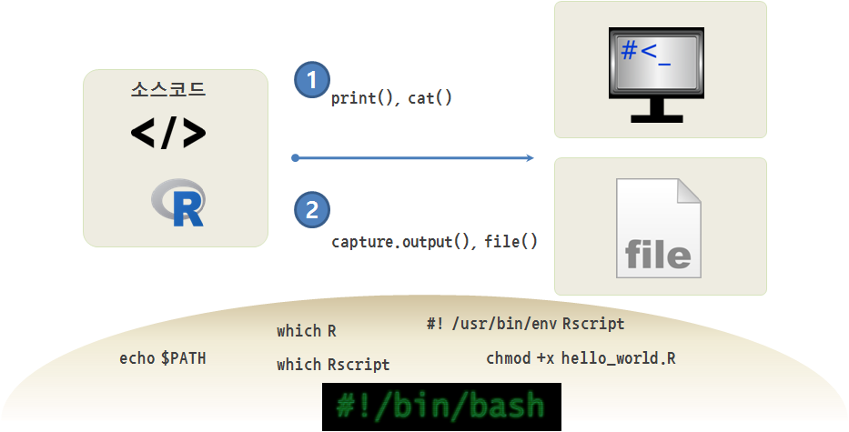

---
output: html_document
editor_options: 
  chunk_output_type: console
---


# 일반적인 작업 자동화 {#r-automation}

파일, 네트워크, 서비스, 그리고 데이터베이스에서 데이터를 읽어왔다.
R은 또한 여러분의 로컬 컴퓨터 디렉토리와 폴더를 훑어서 파일도
읽어온다.

이번 장에서, 여러분의 로컬 컴퓨터를 스캔하고 각 파일에 대해서 연산을
수행하는 프로그램을 작성한다. 파일은 디렉토리(또한 "폴더"라고도
부른다.)에 정렬되어 보관된다. 간단한 R 스크립트로 전체 로컬
컴퓨터나 디렉토리 여기저기 뒤져야 찾아지는 수백 수천개 파일에 대한
단순한 작업을 짧게 수행한다.

트리상의 디렉토리나 파일을 여기저기 돌아다니기 위해서 `os.walk`과 `for`
루프를 사용한다. `open`이 파일 콘텐츠를 읽는 루프를 작성하는 것과
비슷하게, `socket`은 네트워크 연결된 콘텐츠를 읽는 루프를 작성하고,
`urllib`는 웹문서를 열어 콘텐츠를 루프를 통해서 읽어오게 한다.

## 파일 이름과 경로 {#r-paths}

모든 실행 프로그램은 "현재 디렉토리(current directory)"를 가지고 있는데
작업 대부분을 수행하는 디폴트 디렉토리가 된다. 예를 들어, 읽기 위해서
파일을 연다면, R은 현재 디렉토리에서 파일을 찾는다.

`libuv` C 라이브러리에 기반한 [`fs`](https://cran.r-project.org/web/packages/fs/index.html) 
패키지는 파일과 디렉토리를 작업하는 함수를 제공한다. 
`path_wd()` 함수는 현재 디렉토리 이름을 반환한다.


```r
library(fs)

cwd <- fs::path_wd()
# C:/swc/book_programming
```

`cwd` 는 **current working directory**의 약자로 현재 작업 디렉토리다.
예제의 결과는 `C:/swc/book_programming`인데 
현재 작성중인 전자책 `book_programming` 의 홈 디렉토리가 된다.

파일을 식별하는 `cwd` 같은 문자열을 경로(path)라고 부른다.
**상대경로(relative path)**는 현재 디렉토리에서 시작하고,
**절대경로(absolute path)**는 파일 시스템의 가장 최상단의 디렉토리에서
시작한다.

지금까지 살펴본 경로는 간단한 파일 이름이여서, 현재 디렉토리에서
상대적이다. 파일의 절대 경로를 알아내기 위해서 `fs::path_abs()` 함수를
사용한다.


```r
fs::path_abs("index.Rmd")
C:/swc/book_programming/index.Rmd
```

`dir_exists`는 디렉토리, `file_exists`는 파일이 존재하는지 검사한다.


```r
fs::dir_exists("data")
```

```
data  
TRUE
```


```r
fs::file_exists("index.Rmd")
```

```
index.Rmd 
TRUE 
```


`dir_ls()` 함수는 은 주어진 디렉토리에 파일 리스트(그리고 다른 디렉토리)를
반환한다.


```r
fs::dir_ls()
```

```
00-why.Rmd             01-intro.Rmd           02-var.Rmd             03-cont.Rmd            04-func.Rmd            
05-loop.Rmd            06-string.Rmd          07-file.Rmd            08-list.Rmd            09-dictionaries.Rmd    
10-tuples.Rmd          11-regex.Rmd           12-database.Rmd        13-web.Rmd             14-tasks.Rmd           
assets                 book.bib               book_programming.rds   book_programming.Rproj data                   
DESCRIPTION            Dockerfile             docs                   index.Rmd              LICENSE                
now.json               packages.bib           preamble.tex           README.md              references.Rmd         
script                 style.css              toc.css                _bookdown.yml          _bookdown_files        
_build.sh              _common.R              _deploy.sh             _output.yml            _publish.R      
```


## 사례: 사진 디렉토리 정리 {#tasks-picture}

얼마 전에 핸드폰에서 사진을 받아서 서버에 저장하는 [플릭커(Flickr)](https://www.flickr.com/)[^flickr]와
유사한 소프트웨어를 개발했다. 플릭커가 존재하기 전에 작성해고, 플맄커가
생긴 이후에도 계속해서 사용했다. 왜냐하면 영원히 원본을 보관하고 싶어서다.

[^flickr]: 플리커는 미국의 기업 야후의 온라인 사진 공유 커뮤니티 사이트로 2004년 2월부터 운영되고 있다. 웹 2.0의 대표적인 프로그램 중 하나로 거론되며, 캐나다 밴쿠버의 기업인 루디코프에서 개발했다.

문자메시지를 사용해서 한줄 텍스트 문자나 전자우편 주소 제목줄도 보낼 수
있다. 사진 파일과 마찬가지로 텍스프 파일형식 메시지를 동일한 디렉토리에
저장했다. 사진을 찍은 월, 년, 일, 그리고 시간에 기초한 디렉토리 구조다.
다음은 사진 한장과 설명 텍스트를 가진 예제다.

```
    ./2006/03/24-03-06_2018002.jpg
    ./2006/03/24-03-06_2018002.txt
```

7년이 지난 후에, 정말 많은 사진과 짧은 설명문이 생겼다. 시간이 지남에
따라 핸드폰을 바꿨다. 메시지에서 짧은 설명문을 뽑아내는 코드가 잘
동작하지 않고 짧은 설명문 대신에 쓸모없는 데이터를 서버에 추가했다.

파일을 훑어서 어느 텍스트 파일이 정말 짧은 설명문이고, 어는 것이
쓰레기인지 찾아서 잘못된 파일은 삭제하고 싶었다. 첫번째 할 일은 다음
프로그램을 사용하여 폴더에 전체 텍스트 파일 목록을 얻는 것이다.


    import os
    count = 0
    for (dirname, dirs, files) in os.walk('.'):
       for filename in files:
           if filename.endswith('.txt') :
               count = count + 1
    print 'Files:', count

    python txtcount.py
    Files: 1917

이것을 가능하게 하는 가장 중요한 코드는 파이썬 `os.walk` 라이브러리다.
`os.walk`을 호출하고 시작 디렉토리를 지정해 주면, 재귀적으로 모든
디렉토리와 하위 디렉토리를 훑는다. "." 문자열은 현재 디렉토리에서
시작해서 하위 디렉토리로 훑는 것을 표시한다. 디렉토리 각각에 도착하면,
`for` 루프 몸통부분에 있는 튜플에서 값 세개를 얻는다. 첫번째 값은 현재
디렉토리 이름, 두번째 값은 현재 디렉토리의 하위 디렉토리 리스트, 그리고
세번째 값은 현재 디렉토리 파일 리스트다.

명시적으로 하위 디렉토리 각각을 살펴보지 않는다. 왜냐하면, `os.walk`가
자동으로 모든 폴더를 방문할 것이기 때문이다. 하지만, 각 파일을 살펴보고
싶기 때문에, 간단한 `for` 루프를 작성해서 현재 디렉토리에 파일 각각을
조사한다. ".txt"로 끝나는 파일이 있는지 확인한다. 전체 디렉토리 트리를
훑어서 접미사 ".txt"로 끝나는 파일 숫자를 카운트한다.

얼마나 많은 파일이 ".txt" 확장자로 끝나는지 감을 잡았으면, 다음 작업은
자동적으로 어느 파일이 정상이고, 어느 파일이 문제가 있는지를 파이썬이
결정하도록 하는 것이다. 간단한 프로그램을 작성해서 파일과 파일의 크기를
출력한다.

    import os
    from os.path import join
    for (dirname, dirs, files) in os.walk('.'):
       for filename in files:
           if filename.endswith('.txt') :
               thefile = os.path.join(dirname,filename)
               print os.path.getsize(thefile), thefile

파일을 단순히 카운트하는 대신에 `os.path.join`을 사용하여 디렉토리
안에서 디렉토리 이름과 파일 이름을 합쳐서 파일 이름을 생성한다. 문자열
연결 대신에 `os.path.join`을 사용하는 것이 중요한데 왜냐하면 파일 경로를
나타내기 위해서 윈도우에서는 파일 경로를 생성하기 위해서 역슬래쉬(`\`)를
사용하고, 리눅스나 애플에서는 슬래쉬 (`/`)를 사용하기 때문이다.
`os.path.join`은 이러한 차이를 알고 어느 운영체제에서 동작하는지
인지하고 시스템에 따라 적절한 합치기 작업을 수행한다. 그래서 동일한
파이썬 코드가 윈도우나 유닉스계열 시스템에도 실행된다.

디렉토리 경로를 가진 전체 파일 이름을 갖게 되면, `os.path.getsize`
유틸리티를 사용해서 크기를 얻고 출력해서 다음 결과값을 만들어 낸다.

    python txtsize.py
    ...
    18 ./2006/03/24-03-06_2303002.txt
    22 ./2006/03/25-03-06_1340001.txt
    22 ./2006/03/25-03-06_2034001.txt
    ...
    2565 ./2005/09/28-09-05_1043004.txt
    2565 ./2005/09/28-09-05_1141002.txt
    ...
    2578 ./2006/03/27-03-06_1618001.txt
    2578 ./2006/03/28-03-06_2109001.txt
    2578 ./2006/03/29-03-06_1355001.txt
    ...

출력값을 스캔하면, 몇몇 파일은 매우 짧고, 다른 많은 파일은 매우 큰데
동일한 크기(2578, 2565)임을 볼 수 있다. 수작업으로 몇개의 큰 파일을
살펴보면, T-Mobile 핸드폰에서 보내지는 전자우편에 함께 오는 일반적인
동일한 HTML을 가진 것임을 알 수 있다.

    <html>
            <head>
                    <title>T-Mobile</title>
    ...

파일을 대충 살펴보면, 파일에 그다지 유용한 정보가 없으므로 삭제한다.

하지만, 파일을 삭제하기 전에, 한 줄 이상인 파일을 찾고 내용을 출력하는
프로그램을 작성한다. 2578 혹은 2565 문자길이를 가진 파일을 보여주지는
않는다. 왜냐하면, 파일에 더 이상 유용한 정보가 없음을 알기 때문이다.

그래서 다음과 같이 프로그램을 작성한다.

    import os
    from os.path import join
    for (dirname, dirs, files) in os.walk('.'):
       for filename in files:
           if filename.endswith('.txt') :
               thefile = os.path.join(dirname,filename)
               size = os.path.getsize(thefile)
               if size == 2578 or size == 2565:
                   continue
               fhand = open(thefile,'r')
               lines = list()
               for line in fhand:
                   lines.append(line)
               fhand.close()
               if len(lines) > 1:
                    print len(lines), thefile
                    print lines[:4]

`continue`를 사용하여 두 "잘못된 크기(bad sizes)" 파일을 건너뛰고,
나머지 파일을 열고, 파이썬 리스트에 파일 라인을 읽는다. 만약 파일이 하나
이상의 라인이면, 파일에 얼마나 많은 라인이 있는지 출력하고, 첫 세줄을
출력한다.

두개의 잘못된 파일 크기를 제외하고, 모든 한줄짜리 파일이 정상적이라고
가정하고나면 깨끗하게 정리된 파일을 생성된다.

    python txtcheck.py 
    3 ./2004/03/22-03-04_2015.txt
    ['Little horse rider\r\n', '\r\n', '\r']
    2 ./2004/11/30-11-04_1834001.txt
    ['Testing 123.\n', '\n']
    3 ./2007/09/15-09-07_074202_03.txt
    ['\r\n', '\r\n', 'Sent from my iPhone\r\n']
    3 ./2007/09/19-09-07_124857_01.txt
    ['\r\n', '\r\n', 'Sent from my iPhone\r\n']
    3 ./2007/09/20-09-07_115617_01.txt
    ...

하지만, 한가지 더 성가신 패턴의 파일이 있다. 두 공백 라인과 "Sent from
my iPhone"으로 구성된 3줄짜리 파일이다. 프로그램을 다음과 같이 변경하여
이러한 파일도 처리하게 한다.

               lines = list()
               for line in fhand:
                   lines.append(line)
               if len(lines) == 3 and lines[2].startswith('Sent from my iPhone'):
                   continue
               if len(lines) > 1:
                    print len(lines), thefile
                    print lines[:4]

단순하게 3줄짜리 파일이 있는지 검사하고 만약 지정된 텍스트로 세번째
라인이 시작한다면, 건너뛴다.

이제 프로그램을 실행하면, 4개의 다중 라인 파일만을 보게되고 모든 파일이
잘 처리된 것으로 보인다.

    python txtcheck2.py 
    3 ./2004/03/22-03-04_2015.txt
    ['Little horse rider\r\n', '\r\n', '\r']
    2 ./2004/11/30-11-04_1834001.txt
    ['Testing 123.\n', '\n']
    2 ./2006/03/17-03-06_1806001.txt
    ['On the road again...\r\n', '\r\n']
    2 ./2006/03/24-03-06_1740001.txt
    ['On the road again...\r\n', '\r\n']

프로그램의 전반적인 패턴을 살펴보면, 연속적으로 파일을 어떻게 승인할지와
거절할지를 정교화했고, "잘못된" 패턴을 발견하면 `continue`를 사용해서
잘못된 파일을 건너뛰게 했다. 그래서 잘못된 더 많은 파일 패턴이
탐지되도록 코드를 정교화했다.

이제 파일을 삭제할 준비가 되었다. 로직을 바꿔서, 나머지 올바른 파일을
출력하는 대신에, 삭제할 "잘못된" 파일만을 출력한다.

    import os
    from os.path import join
    for (dirname, dirs, files) in os.walk('.'):
       for filename in files:
           if filename.endswith('.txt') :
               thefile = os.path.join(dirname,filename)
               size = os.path.getsize(thefile)
               if size == 2578 or size == 2565:
                   print 'T-Mobile:',thefile
                   continue
               fhand = open(thefile,'r')
               lines = list()
               for line in fhand:
                   lines.append(line)
               fhand.close()
               if len(lines) == 3 and lines[2].startswith('Sent from my iPhone'):
                   print 'iPhone:', thefile
                   continue

이제 삭제할 대상 목록과 왜 이 파일이 삭제 대상으로 나왔는지를 볼 수
있다. 프로그램은 다음 출력을 생성한다.

    python txtcheck3.py
    ...
    T-Mobile: ./2006/05/31-05-06_1540001.txt
    T-Mobile: ./2006/05/31-05-06_1648001.txt
    iPhone: ./2007/09/15-09-07_074202_03.txt
    iPhone: ./2007/09/15-09-07_144641_01.txt
    iPhone: ./2007/09/19-09-07_124857_01.txt
    ...

무작위로 파일을 검사해서 프로그램에 버그가 우연하게 들어가 있는지 혹은
원치 않는 파일이 작성한 프로그램 로직에 끌려들어 갔는지 확인할 수 있다.

결과값에 만족하고, 다음이 삭제할 파일 목록임으로, 프로그램에 다음과 같은
변경을 한다.

               if size == 2578 or size == 2565:
                   print 'T-Mobile:',thefile
                   os.remove(thefile)
                   continue
    ...
               if len(lines) == 3 and lines[2].startswith('Sent from my iPhone'):
                   print 'iPhone:', thefile
                   os.remove(thefile)
                   continue

이번 버젼의 프로그램에서 파일을 출력하고 `os.remove`을 사용하여 잘못된
파일을 삭제한다.

    python txtdelete.py 
    T-Mobile: ./2005/01/02-01-05_1356001.txt
    T-Mobile: ./2005/01/02-01-05_1858001.txt
    ...

재미로, 프로그램을 두번 실행하게 되면 모든 잘못된 파일이 삭제되어서
출력값이 없다.

`txtcount.py`을 다시 실행하면, 899 잘못된 파일이 삭제되었음을 알 수
있다.

    python txtcount.py 
    Files: 1018

이번 장에서 일련의 절차에 따라 파이썬을 사용하여 디렉토리와 파일을
검색하는 패턴을 살펴봤다. 천천히 파이썬을 사용해서 디렉토리를 정리하기
위해서 무엇을 할지를 결정했다. 어느 파일이 좋고 어느 파일이 유용하지
않는지 파악한 후에 파이썬을 사용해서 파일을 삭제하고 파일 정리를
수행했다.

해결하려고 하는 문제가 무척 간단하여 파일 이름만을 살펴보는 것으로
충분히 처리할 수 있다. 혹은 모든 파일을 읽고 파일 내부에 패턴을 찾을
필요가 있을 수도 있다. 때때로, 모든 파일을 읽고, 파일의 일부에 변경이
필요할지도 모른다. `os.walk`와 다른 `os` 유틸리티가 어떻게 사용되는지
이해하기만 하면 이 모든 것은 매우 명확한다.

## 명령 줄 인자 {#tasks-commandline}


앞선 장에서 `raw_input`을 사용하여 파일명을 사용자로부터 입력받고,
파일에서 데이터를 읽어 다음과 같이 처리했다.

    name = raw_input('Enter file:')
    handle = open(name, 'r')
    text = handle.read()
    ...

파이썬을 시작할 때, 명령 라인에서 파일 이름을 입력 받음으써 프로그램을
간략화 할 수 있다. 지금까지 파이썬 프로그램을 단순하게 실행하고 다음과
같이 명령어 프롬프트에 응답했다.

    python words.py
    Enter file: mbox-short.txt
    ...

파이썬 파일 다음에 추가 문자열을 배치하고 파이썬 프로그램에서 **명령 줄
인수(command line arguments)**에 접근한다. 명령 줄에서 인자를 읽는 것을
시연하는 간단한 프로그램이 다음에 있다.

    import sys
    print 'Count:', len(sys.argv)
    print 'Type:', type(sys.argv)
    for arg in sys.argv:
       print 'Argument:', arg

`sys.argv`의 콘텐츠는 문자열 리스트로 첫 문자열은 파이썬 프로그램 이름,
그리고 나머지 문자열은 파이썬 파일 다음의 명령 줄의 인자들이다.

다음은 명령 줄에서 명령 줄 인자 몇개를 읽어들이는 프로그램이다.

    python argtest.py hello there
    Count: 3
    Type: <type 'list'>
    Argument: argtest.py
    Argument: hello
    Argument: there

세가지 요소 리스트로 프로그램에 넘겨지는 인자가 3개 있다. 리스트의 첫
요소는 파일 이름 (argtest.py) 그리고 나머지는 파일 이름 뒤에 2 명령 줄
인자다.

파일을 읽어 오는 프로그램을 다시 작성할 수 있다. 다음과 같이 명령 줄
인자로 파일 명을 받는다.

    import sys

    name = sys.argv[1]
    handle = open(name, 'r')
    text = handle.read()
    print name, 'is', len(text), 'bytes'

두번째 명령 줄 인자를 파일 이름으로 취한다. ( `[0]` 항목 프로그램 이름은
생략한다.) 파일을 열고 다음과 같이 콘텐츠를 읽는다.

    python argfile.py mbox-short.txt
    mbox-short.txt is 94626 bytes

입력값으로 명령문 인자를 사용하는 것은 파이썬 프로그램을 재사용하기 쉽게
하고, 특히 하나 혹은 두개의 문자열을 입력받을 때 유용한다.

## 파이프(Pipes) {#tasks-pipe}

대부분의 운영 시스템은 **쉘(shell)**로 알려진 명령어 기반 인터페이스를
지원한다. 일반적으로 쉘은 파일 시스템을 탐색하거나 응용 프로그램을
실행하는 명령어를 지원한다. 예를 들어, 유닉스에서 `cd` 명령어로
디렉토리를 변경하고 `ls` 명령어로 디렉토리의 콘텐츠를 보여주고,
`firefox`를 타이핑해서 웹브라우져를 실행한다.

쉘에서 실행시킬 수 있는 어떤 프로그램이나 **파이프(pipe)**를 사용하여
파이썬에서도 실행시킬 수 있다. 파이프는 작동중인 프로세스를 표현하는
객체다.

예를 들어, 유닉스 명령어[^unix-ls] `ls -l`는 정상적으로 현재 디렉토리의
콘텐츠(긴 형식으로)를 보여준다. `system2()` 내장함수, 혹은 
[`processx`](https://cran.r-project.org/web/packages/processx/index.html), 
[`sys`](https://cran.r-project.org/web/packages/sys/index.html) 패키지를
가지고 `ls` 를 실행시킬 수 있다.

[^unix-ls]: 파이프를 사용하여 `ls` 같은 운영 시스템 명령어로 대화할 때, 무슨
    운영 시스템을 사용하는지 알고 운영 시스템에서 지원되는 명령어로
    파이프를 열수 있다는 것이 중요하다.


```r
system2("ls", "-l", stdout = TRUE, stderr = TRUE)
```

```
 [1] "total 960"                                                                
 [2] "-rw-r--r--   1 tidyverse  staff  16280  5 18 10:26 00-why.Rmd"            
 [3] "-rw-r--r--   1 tidyverse  staff  44481  5 18 10:26 01-intro.Rmd"          
 [4] "-rw-r--r--   1 tidyverse  staff  25092  5 18 10:26 02-var.Rmd"            
 [5] "-rw-r--r--   1 tidyverse  staff  20041  5 18 10:26 03-cont.Rmd"           
 [6] "-rw-r--r--   1 tidyverse  staff  24862  5 18 10:26 04-func.Rmd"           
 [7] "-rw-r--r--   1 tidyverse  staff  19254  5 18 10:26 05-loop.Rmd"           
 [8] "-rw-r--r--   1 tidyverse  staff  19007  5 18 10:26 06-string.Rmd"         
 [9] "-rw-r--r--   1 tidyverse  staff  26301  5 18 10:26 07-file.Rmd"           
[10] "-rw-r--r--   1 tidyverse  staff  27648  5 18 10:26 08-list.Rmd"           
[11] "-rw-r--r--   1 tidyverse  staff  22463  5 18 10:26 09-dictionaries.Rmd"   
[12] "-rw-r--r--   1 tidyverse  staff  12085  5 18 10:26 10-tuples.Rmd"         
[13] "-rw-r--r--   1 tidyverse  staff  30744  5 18 12:42 11-regex.Rmd"          
[14] "-rw-r--r--   1 tidyverse  staff  36390  5 19 11:15 12-database.Rmd"       
[15] "-rw-r--r--   1 tidyverse  staff  18931  5 19 11:15 13-web.Rmd"            
[16] "-rw-r--r--   1 tidyverse  staff  32936  5 19 12:19 14-tasks.Rmd"          
[17] "-rw-r--r--   1 tidyverse  staff    115  5 18 10:26 DESCRIPTION"           
[18] "-rw-r--r--   1 tidyverse  staff    150  5 18 10:26 Dockerfile"            
[19] "-rw-r--r--   1 tidyverse  staff   6556  5 18 10:26 LICENSE"               
[20] "-rw-r--r--   1 tidyverse  staff    741  5 18 10:26 README.md"             
[21] "-rw-r--r--   1 tidyverse  staff    671  5 19 11:15 _bookdown.yml"         
[22] "-rw-r--r--   1 tidyverse  staff    235  5 18 10:26 _build.sh"             
[23] "-rw-r--r--   1 tidyverse  staff    842  5 18 10:26 _common.R"             
[24] "-rwxr-xr-x   1 tidyverse  staff    398  5 18 10:26 _deploy.sh"            
[25] "-rw-r--r--   1 tidyverse  staff    360  5 18 10:26 _output.yml"           
[26] "-rw-r--r--   1 tidyverse  staff   1427  5 18 10:26 _publish.R"            
[27] "drwxr-xr-x   4 tidyverse  staff    128  5 18 14:45 assets"                
[28] "-rw-r--r--   1 tidyverse  staff   3203  5 18 10:26 book.bib"              
[29] "-rw-r--r--   1 tidyverse  staff    277  5 18 10:26 book_programming.Rproj"
[30] "-rw-r--r--   1 tidyverse  staff    208  5 19 12:10 book_programming.rds"  
[31] "drwxr-xr-x  10 tidyverse  staff    320  5 18 14:04 data"                  
[32] "drwxr-xr-x  48 tidyverse  staff   1536  5 19 12:10 docs"                  
[33] "-rw-r--r--   1 tidyverse  staff   6272  5 18 10:26 index.Rmd"             
[34] "-rw-r--r--   1 tidyverse  staff     41  5 18 10:26 now.json"              
[35] "-rw-r--r--   1 tidyverse  staff   2655  5 18 10:26 packages.bib"          
[36] "-rw-r--r--   1 tidyverse  staff    161  5 18 10:26 preamble.tex"          
[37] "-rw-r--r--   1 tidyverse  staff     55  5 18 10:26 references.Rmd"        
[38] "drwxr-xr-x   4 tidyverse  staff    128  5 18 10:26 script"                
[39] "-rw-r--r--   1 tidyverse  staff    172  5 18 10:26 style.css"             
[40] "-rw-r--r--   1 tidyverse  staff   2443  5 18 10:26 toc.css"   
```

인자는 쉘 명령어를 포함하는 문자열이다. 

### 유닉스 철학과 파이프 {#tasks-pipe}

{width=100%}

통계 예측모형, 기계학습, 딥러닝 시스템을 개발할 경우 유닉스/리눅스 운영체제로 환경을 통일하고 텍스트 파일을 모든 프로그램과 시스템이 의사소통하는 기본 인터페이스로 잡고, 이를 파이프로 연결한다.

1. 텍스트 데이터로 분석에 사용될 혹은 훈련데이터로 준비한다.
1. 파이썬 혹은 쉘스크립트, R스크립트를 활용하여 전처리한다.
1. R `tidymodels` 혹은 파이썬 `Scikit-learn` 예측모형을 적합, 기계학습 훈련, 시각화를 수행한다.
1. 마크다운(웹), LaTeX(조판) 출력형식에 맞춰 서식을 결정한다.
1. 최종 결과를 텍스트, 이미지 파일, pdf, html로 출력한다.


```shell
$ cat data.txt | preProcesswithPython.py | runModelwithR.R | formatOutput.sh > mlOutput.txt
```

::: {#unix-philosophy .rmdcaution}

**[유닉스 철학](https://en.wikipedia.org/wiki/Unix_philosophy)**

[원문] Write programs that do one thing and do it well. Write programs to work together. Write programs to handle text streams, because that is a universal interface. -- Doug McIlroy
 
* 한가지 작업만 매우 잘하는 프로그램을 작성한다(Write programs that do one thing and do it well)
* 프로그램이 함께 동작하도록 작성한다(Write programs to work together)
* 텍스트를 다루는 프로그램을 작성한다. 이유는 어디서나 사용되는 인터페이스가 되기 때문이다(Write programs to handle text streams, because that is a universal interface)

:::


## 용어정의 {#tasks-terminology}


- **절대경로(absolute path)**:
    파일이나 디렉토리가 어디에 저장되어 있는지를 저장하는 문자열로
    "최상단의 디렉토리"에서 시작해서, 현재 작업 디렉토리에 관계없이
    파일이나 디렉토리를 접근하는데 사용할 수 있다.
- **체크썸(checksum)**: 
    **해싱(hashing)**을 참조하세요. "체크썸(checksum)"단어는 네트워크로
    데이터가 보내지거나 백업 매체에 쓰여지고 다시 읽어올 때, 데이터가
    왜곡되었는지를 검증하는 필요에서 생겨났다. 데이터가 쓰여지거나
    보내질 때, 송신 시스템은 체크썸을 계산하고 또한 체크썸도 보낸다.
    데이터가 읽혀지거나 받았을 때, 수신 시스템을 수신된 데이터의
    체크썸을 다시 계산하고 받은 체크썸과 비교한다. 만약 체크썸이
    매칭되지 않으면, 전송 시에 데이터가 왜곡된 것으로 판단해야 한다.
- **명령 줄 인자(command line argument)**:
    파이썬 파일 이름 뒤에 명령 줄에 매개 변수.
- **현재 작업 디렉토리(current working directory)**:
    여러분이 "작업하고 있는" 현재 디렉토리. 명령-줄 인터페이스에서
    대부분의 시스템에 `cd` 명령어를 사용하여 작업 디렉토리를 변경할 수
    있다. 경로 정보 없이 파일만을 사용하여 파이썬에서 파일을 열게 될 때,
    파일은 프로그램을 실행하고 있는현재 작업 디렉토리에 있어야 한다.
- **해싱(hashing)**:
    가능한 큰 데이터를 읽고 그 데이터에 대해서 유일한 체크썸을 생성하는
    것. 최고의 해쉬 함수는 거의 "충돌(collision)"을 만들지 않는다.
    여기서 충돌은 서로 다른 두 데이터 스트림에 해쉬 함수를 줄 때 동일한
    해쉬값을 돌려받는 것이다. MD5, SHA1, SHA256 는 가장 많이 사용되는
    해쉬 함수의 사례다.
- **파이프(pipe)**:
    파이프는 실행하는 프로그램에 연결이다. 파이프를 사용해서, 데이터를
    다른 프로그램에 보내거나 그 프로그램에서 데이터를 받는 프로그램을
    작성할 수 있다. 파이프는 **소켓(socket)**과 매우 유사하다. 차이점은
    파이프는 동일한 컴퓨터에서 실행되는 프로그램을 연결하는데만
    사용된다는 것이다. (즉, 네트워크를 통해서는 사용할 수 없다.)
- **상대경로(relative path)**:
    파일 혹은 디렉토리가 어디에 저장되었는지를 현재 작업 디렉토리에
    상대적으로 표현하는 문자열.
- **쉘(shell)**: 
    운영 시스템에 명령줄 인터페이스. 다른 시스템에서는 또한 "터미널
    프로그램(terminal program)"이라고 부른다. 이런 인터페이스에서 라인에
    명령어와 매개 변수를 타입하고 명령을 실행하기 위해서 "엔터(enter)"를
    누른다.
- **워크(walk)**:
    모든 디렉토리를 방문할 때까지 디렉토리, 하위 디렉토리, 하위의 하위
    디렉토리 전체 트리를 방문하는 개념을 나타내기 위해서 사용된 용어.
    여기서 이것을 "디렉토리 트리를 워크"한다고 부른다.

## 연습문제 {#tasks-exercise}

MP3 파일이 대규모로 수집되어 있은 곳에는 같은 노래의 복사본 하나 이상이
다른 디렉토리 혹은 다른 파일 이름으로 저장되어 있을 수 있다. 이번
연습문제의 목표는 이런 중복 파일을 찾는 것이다.

1.  `.mp3`같은 확장자를 가진 파일을 모든 디렉토리와 하위 디렉토리를
    검색해서 동일한 크기를 가진 파일짝을 목록으로 보여주는 프로그램을
    작성하세요. 

2.  **체크썸(checksum)** 알고리즘이나 해싱을 사용하여 중복 콘텐츠를 가진
    파일을 찾는 이전의 프로그램을 개작하세요. 예를 들어, MD5
    (Message-Digest algorithm 5)는 임의적으로 긴 "메시지"를 가지고
    128비트 "체크썸"을 반환한다. 다른 콘텐츠를 가진 두 파일이 같은
    체크썸을 반환할 확률은 매우 적다.

    [wikipedia.org/wiki/Md5](wikipedia.org/wiki/Md5)에서 MD5에 대해서 더
    배울 수 있다. 다음 코드 조각은 파일을 열고, 읽고, 체크썸을 계산한다.


    체크섬을 계산하고 키로 이미 딕셔너리에 있게 되면, 중복 콘텐츠인 두
    파일 있어서 딕셔너리에 파일과 방금전에 읽은 파일을 출력한다. 사진
    파일 폴더에서 실행한 샘플 출력물이 다음에 있다.

```
        ./2004/11/15-11-04_0923001.jpg ./2004/11/15-11-04_1016001.jpg
        ./2005/06/28-06-05_1500001.jpg ./2005/06/28-06-05_1502001.jpg
        ./2006/08/11-08-06_205948_01.jpg ./2006/08/12-08-06_155318_02.jpg
```

    명백하게 때때로 같은 사진을 한번 이상 보내거나 원본을 삭제하지 않고
    종종 사진 사본을 만든다.


## R 스크립트 실행 [^R-scripts] [^RScript-kor] {#run-r-script}

[^R-scripts]: [R scripts](http://www.r-bloggers.com/r-scripts/)

[^RScript-kor]: [.R 스크립트를 인자와 함께 실행](http://statkclee.github.io/parallel-r/r-parallel-rscript-exec.html)

{width=100%}
명령라인 인터페이스에서 R 스크립트를 실행하고 다양한 R 스크립트 실행방법을 살펴보자.
먼저, 유닉스/리눅스/윈도우 운영체제가 준비되었다면 R스크립트 실행환경을 준비한다.

### R 설치 {#install-r}

R을 스크립트 형태(`.R`) 파일로 실행할 경우 가장 먼저 `r-base-core`를 설치한다. 
그래픽 사용자 인터페이스가 없는 형태의 R이 설치되며 R 스크립트 실행에 필요한 
연관된 프로그램도 더불어 설치한다.

```
$ sudo apt-get install -y r-base-core
```

### R 스크립트 실행환경 {#install-env} 

R과 스크립트를 실행할 `Rscript` 실행프로그램이 위치한 디렉토리를 확인한다. 
여기에 사용되는 명령어는 `which`다.
`which R` 명령어를 통해 R 실행파일이 `/usr/bin/` 디렉토리에 위치한 것을 확인할 수 있다.

```
$ which R
/usr/bin/R
```

`which Rscript` 명령어를 통해 Rcript 실행파일도 
`/usr/bin/` 디렉토리에 위치한 것을 확인할 수 있다.

```
$ which Rscript
/usr/bin/Rscript
```

`echo $PATH` 명령어를 통해 `/usr/bin`, 경우에 따라서는 `/usr/local/bin` 
디렉토리에 R과 Rscript 실행파일이 존재하는 것을 확인한다.

```
$ echo $PATH
/usr/local/sbin:/usr/local/bin:/usr/sbin:/usr/bin:/sbin:/bin:/usr/games:/usr/local/games
```

### R 스크립트 파일 실행 {#exec-rscript} 

`.R` 스크립트 파일을 명령라인 인터페이스로 실행하는 방법은 다양한다. 
먼저 `hello_world.R` 스크립트 파일을 생성한다.

```
#! /usr/bin/env Rscript

print("Hello World!!!")
```

쉬뱅(shebang, #!) 다음에 스크립트를 실행할 프로그램을 지정한다. 
`Rscript`로 지정하여 R스크립트를 실행하는데 사용한다.

`#! /usr/bin/env Rscript`

```
$ chmod +x hello_world.R
$ ./hello_world.R
```

`chmod +x` 명령어를 통해서 일반 텍스트 파일을 실행가능한 
파일 형식으로 지정한다.
`hello_world.R` 파일이 실행가능한 형태가 되었기 때문에 
`./hello_world.R` 명령어로 R스크립트를 실행시킨다.

```
Hello World!!!
```

### 다른 R 스크립트 파일 실행법 {#exec-run-other-ways}

R스크립트를 실행하는 방법은 다양하다.

```
$ R --slave -f hello_world.R
$ Rscript hello_world.R
```

`Rscript` 명령어로 실행을 시켜도 동일한 산출 결과가 출력된다.

```
$ R CMD BATCH hello_world.R hello_world_output.txt
```

`R CMD BATCH` 명령어로 실행시키면 실행결과가 `hello_world_output.txt` 파일에 저장된다. `hello_world_output.txt` 파일명을 지정하지 않으면 `hello_world.Rout` 파일에 저장된다.

```
$ R --no-save << RSCRIPT
     print("Hello World")
  RSCRIPT
```

`R --no-save <<` 사용법도 가능하다.

## 실습 사례 [^swcarpentry-r-cmd] {#tasks-swcarpentry}

[^swcarpentry-r-cmd]: [R프로그래밍 - 명령-라인 프로그램](http://statkclee.github.io/r-novice-inflammation/05-cmdline-kr.html)

### R스크립트 작성 {#make-rscript}

`Rscript r_session_info.R` 명령어를 실행해서 
실제로 RStudio나 R 콘솔을 열지 않고도 R 세션정보를 명령라인 인터페이스에서 처리하는 R 스크립트를 작성한다.

텍스트 편집기를 열고, `sessionInfo()`를 적고 파일명을 `r_session_info.R`로 저장한다.


```r
sessionInfo()
```

배쉬쉘에서 R스크립트를 실행해서 R 세션정보를 받아확인한다.


```shell
$ Rscript r_session_info.R
```

```
R version 3.0.2 (2013-09-25)
Platform: x86_64-pc-linux-gnu (64-bit)

locale:
 [1] LC_CTYPE=en_US.UTF-8       LC_NUMERIC=C
 [3] LC_TIME=en_US.UTF-8        LC_COLLATE=en_US.UTF-8
 [5] LC_MONETARY=en_US.UTF-8    LC_MESSAGES=en_US.UTF-8
 [7] LC_PAPER=en_US.UTF-8       LC_NAME=C
 [9] LC_ADDRESS=C               LC_TELEPHONE=C
[11] LC_MEASUREMENT=en_US.UTF-8 LC_IDENTIFICATION=C

attached base packages:
[1] stats     graphics  grDevices utils     datasets  base
```

### R스크립트 출력결과 파일저장 {#sessionInfo-save}

`>` 파이프 연산자를 사용해서 R 스크립트 출력결과를 텍스트 파일로 저장한다.


```shell
$ Rscript r_session_info.R > r_session_info_pipe_output.txt
```

또다른 방법은 R 스크립트 내부에서 출력결과를 파일에 저장하고 
프로그램을 종료하는 방법도 있다.

`caputre.output` 함수를 `cat`과 함께 사용하는데, 
한글도 적용이 가능하도록, `encoding="UTF-8"`도 추가한다.


```r
output <- capture.output(sessionInfo())
cat("R 세션정보", output, file="./r_session_info_rscript.txt", sep="\n", encoding="UTF-8")
```

`Rscript r_session_info.R` 명령어를 실행시키면 다음과 같이 실행결과가 텍스트 파일 `r_session_info_rscript.txt`로 떨어진다.

```
R 세션정보
R version 3.0.2 (2013-09-25)
Platform: x86_64-pc-linux-gnu (64-bit)

locale:
 [1] LC_CTYPE=en_US.UTF-8       LC_NUMERIC=C
 [3] LC_TIME=en_US.UTF-8        LC_COLLATE=en_US.UTF-8
 [5] LC_MONETARY=en_US.UTF-8    LC_MESSAGES=en_US.UTF-8
 [7] LC_PAPER=en_US.UTF-8       LC_NAME=C
 [9] LC_ADDRESS=C               LC_TELEPHONE=C
[11] LC_MEASUREMENT=en_US.UTF-8 LC_IDENTIFICATION=C

attached base packages:
[1] stats     graphics  grDevices utils     datasets  base
UTF-8
```

* [optparse - Command Line Option Parser](https://cran.r-project.org/web/packages/optparse/index.html)
* [argparse - Command line optional and positional argument parser](https://cran.r-project.org/web/packages/argparse/index.html)
* [getopt - C-like getopt behavior](https://cran.r-project.org/web/packages/getopt/)


