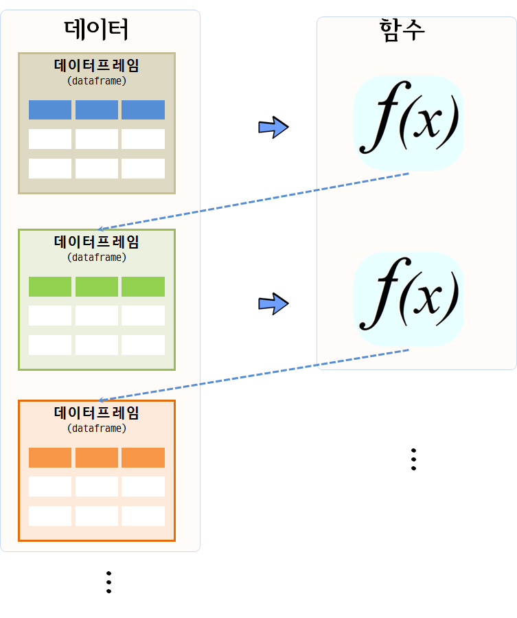
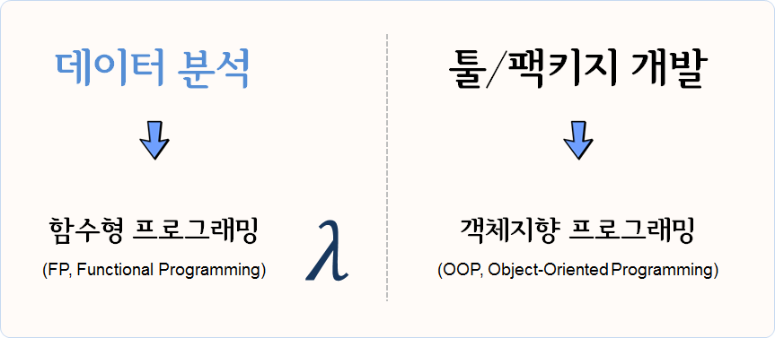
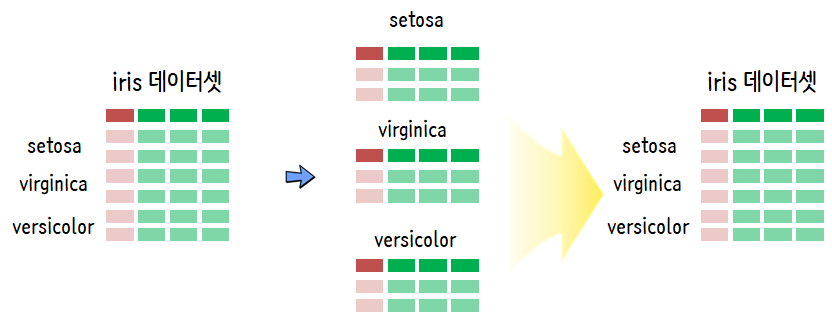
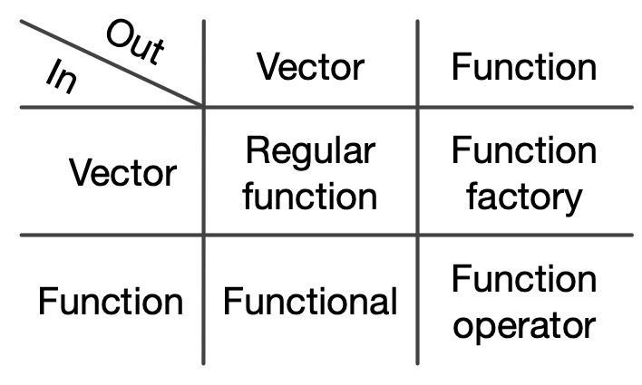

---
output: html_document
editor_options: 
  chunk_output_type: console
---


# 함수형 프로그래밍 {#r-functional-programming}

데이터 과학 맥락에서 함수형 프로그래밍을 이해하고, 수치해석 예제를 통해 코드를 작성하고,
함수형 프로그래밍과 짝꿍인 단위 테스트에 대해서 살펴본다.

**함수형 프로그래밍(functional programming)**은 코드를 작성하는 한 방식으로 
특정 연산을 수행하는 함수를 먼저 작성하고 나서,
사용자가 함수를 호출해서 작업을 수행하는 방식이다. 순수 함수형 언어, 예를 들어 [하스케(Haskell)](https://ko.wikipedia.org/wiki/하스켈)은 루프가 없다.
루푸없이 어떻게 프로그램을 작성할 수 있을까? 루프는 재귀(recursion)로 대체된다. 이런 이유로 아래에서
뉴톤 방법을 통해 근을 구하는 방식을 R코드로 두가지 방법을 보여준다. R은 아직 
[꼬리 호출(tail-call recurssion)](http://hanmomhanda.github.io/2015/07/27/%EC%9E%AC%EA%B7%80-%EB%B0%98%EB%B3%B5-Tail-Recursion/) 기능을 
제공하지 않기 때문에 루프를 사용하는 것이 더 낫다. 

수학 함수는 멋진 특성이 있는데, 즉 해당 입력에 항상 동일한 결과를 갖는다. 
이 특성을 **참조 투명성(referential transparaency)** 이라고 부른다.
참조 투명성은 **부수효과(side effect)** 없음을 표현하는 속성인데, 함수가 결과값 외에 다른 상태를 변경시킬 때 부수효과(side effect)가 있다고 한다.
부수 효과는 프로그램 버그를 발생시키는 온상으로, 부수 효과를 없애면 디버깅이 용이해진다.
따라서, 부수 효과를 제거하고 참조 투명성을 유지함으로써 데이터 분석 수행 결과를 예측 가능한 상태로 유지시켜 **재현가능한 과학**이 가능하게 된다.

::: {#about-fp .rmdcaution}

**함수형 프로그래밍**

R 함수형 프로그래밍을 이해하기 위해서는 먼저 자료구조에 대한 이해가 선행되어야 한다. 
그리고 나서, 함수를 작성하는 이유와 더불어 작성법에 대한 이해도 확고히 해야만 한다.
 
객체(object)가 함수를 갖는 데이터라면, 클러져는 데이터를 갖는 함수다.
 
> "An object is data with functions. A closure is a function with data." -- John D. Cook
:::

명령형 언어(Imperative Language) 방식으로 R코드를 쭉 작성하게 되면, 
각 단계별로 상태가 변경되는 것에 대해 신경을 쓰고 관리를 해나가야 된다.
그렇지 않으면 예기치 않은 부수 효과가 발생하여 데이터 분석 및 모형을 잘못 해석하게 된다.

그렇다고, 부수효과가 없는 순수 함수가 반듯이 좋은 것은 아니다. 
예를 들어 `rnorm()` 함수를 통해 평균 0, 분산 1인 난수를 생성시키는데,
항상 동일한 값만 뽑아내면 사용자에게 의미있는 함수는 아니다. 

결국, 함수형 프로그래밍을 통해 **테스팅(testing)**과 **디버깅(debugging)**을 
수월하게 하는 것이 추구하는 바이다. 이를 위해 
다음 3가지 요인이 중요하다. 

- 한번에 한가지 작업을 수행하는 함수 
- 부수효과(side effect) 회피
- 참조 투명성(Referential transparaency)

## 왜 함수형 프로그래밍인가? {#why-functional-programming}

데이터 분석을 아주 추상화해서 간략하게 얘기한다면 데이터프레임을 
함수에 넣어 새로운 데이터프레임으로 만들어 내는 것이다.

{width=100%}

데이터 분석, 데이터 전처리, 변수 선택, 모형 개발이 한번에 해결되는 것이 아니라서, 
데이터프레임을 함수에 넣어 상태가 변경된 데이터프레임이 생성되고, 
이를 다시 함수에 넣어 또다른 변경된 상태 
데이터프레임을 얻게 되는 과정을 쭉 반복해 나간다.

{width=100%}

따라서... 데이터 분석에는 함수형 프로그래밍 패러다임을 활용하고, 툴/패키지 개발에는 객체지향 프로그래밍(OOP) 패러다임 사용이 권장된다.

{width=100%}


## 사례: [뉴튼 방법(Newton's Method)](https://en.wikipedia.org/wiki/Newton%27s_method) {#functional-programming-newton}

뉴튼-랩슨 알고리즘으로도 알려진 뉴튼(Newton Method) 방법은 
컴퓨터를 사용해서 수치해석 방법으로 실함수의 근을 찾아내는 방법이다. 

특정 함수 $f$ 의 근을 찾을 경우, 함수 미분값 $f'$, 초기값 $x_0$가 주어지면 
근사적 근에 가까운 값은 다음과 같이 정의된다.

$$x_{1} = x_0 - \frac{f(x_0)}{f'(x_0)}$$

이 과정을 반복하게 되면 오차가 매우 적게 근의 값에 도달하게 된다.

$$x_{n+1} = x_n - \frac{f(x_n)}{f'(x_n)}$$

기하적으로 보면, 파란 선은 함수 $f$ 이고, 
$f$를 미분한 $f'$ 빨간 선은  뉴턴방법을 활용하여 근을 구해가는 과정을 시각적으로 보여주고 있다.
$x_{n-1}$ 보다 $x_n$이, $x_n$ 보다 $x_{n+1}$이 함수 $f$ 근에 더 가깝게 접근해 나가는 것이 확인된다.

<!-- {width=100%} -->

### 뉴튼 방법 R 코드 [^fp-book] {#functional-programming-newton-method}

[^fp-book]: [Bruno Rodrigues(2016), "Functional programming and unit testing for data munging with R", LeanPub, 2016-12-23](http://www.brodrigues.co/fput/)

뉴튼 방법을 R코들 구현하면 다음과 같이 612의 제곱근 값을 수치적으로 컴퓨터를 활용하여 구할 수 있다.
`while`같은 루프를 활용하여 반복적으로 해를 구하는 것도 가능하지만 재귀를 활용하여 해를 구하는 방법이 
코드를 작성하고 읽는 개발자 관점에서는 훨씬 더 편리하고 권장된다.

하지만, 속도는 `while` 루프를 사용하는 것이 R에서는 득이 많다. 이유는 오랜 세월에 걸쳐 최적화 과정을 거쳐 진화했기 때문이다.

<div class = "row">
<div class = "col-md-6">
**while 루프를 사용한 방법**


```r
find_root <- function(guess, init, eps = 10^(-10)){
    while(abs(init**2 - guess) > eps){
        init <- 1/2 *(init + guess/init)
        cat("현재 값: ", init, "\n")
    }
    return(init)
}

find_root(612, 10)
```

```
## 현재 값:  35.6 
## 현재 값:  26.4 
## 현재 값:  24.8 
## 현재 값:  24.7 
## 현재 값:  24.7 
## 현재 값:  24.7
```

```
## [1] 24.7
```

</div>
<div class = "col-md-6">
**재귀를 사용한 방법**


```r
find_root_recur <- function(guess, init, eps = 10^(-10)){
    if(abs(init**2 - guess) < eps){
        return(init)
    } else{
        init <- 1/2 *(init + guess/init)
        cat("재귀방법 현재 값: ", init, "\n")
        return(find_root_recur(guess, init, eps))
    }
}

find_root_recur(612, 10)
```

```
## 재귀방법 현재 값:  35.6 
## 재귀방법 현재 값:  26.4 
## 재귀방법 현재 값:  24.8 
## 재귀방법 현재 값:  24.7 
## 재귀방법 현재 값:  24.7 
## 재귀방법 현재 값:  24.7
```

```
## [1] 24.7
```
</div>
</div>


### `Map()`, `Reduce()` 함수와 `*apply()` 함수 가족 [^jennybc-purrr] [^jennybc-purrr-github] {#map-reduce-apply}

[^jennybc-purrr]: [`purrr` tutorial: Lessons and Examples](https://jennybc.github.io/purrr-tutorial/index.html)

[^jennybc-purrr-github]: [`purrr` tutorial GitHub Webpage](https://github.com/jennybc/purrr-tutorial/)

함수를 인자로 받는 함수를 고차함수(High-order function)라고 부른다. 
대표적으로 `Map()`, `Reduce()`가 있다. 숫자 하나가 아닌 벡터에 대한 제곱근을 구하기 위해서 
`Map` 함수를 사용한다.


```r
# 제곱근 함수 -------------------------------------------

find_root_recur <- function(guess, init, eps = 10^(-10)){
    if(abs(init**2 - guess) < eps){
        return(init)
    } else{
        init <- 1/2 *(init + guess/init)
        return(find_root_recur(guess, init, eps))
    }
}

# 벡터에 대한 제곱근 계산 

numbers <- c(16, 25, 36, 49, 64, 81)
Map(find_root_recur, numbers, init=1, eps = 10^-10)
```

```
## [[1]]
## [1] 4
## 
## [[2]]
## [1] 5
## 
## [[3]]
## [1] 6
## 
## [[4]]
## [1] 7
## 
## [[5]]
## [1] 8
## 
## [[6]]
## [1] 9
```

숫자 하나를 받는 함수가 아니라, 벡터를 인자로 받아 제곱근을 계산하는 함수를 
작성할 경우 함수 내부에서 함수를 인자로 받을 수 있도록 `Map` 함수를 활용한다.


```r
# `Map` 벡터 제곱근 계산

find_vec_root_recur <- function(numbers, init, eps = 10^(-10)){
    return(Map(find_root_recur, numbers, init, eps))
}

numbers_z <- c(9, 16, 25, 49, 121)
find_vec_root_recur(numbers_z, init=1, eps=10^(-10))
```

```
## [[1]]
## [1] 3
## 
## [[2]]
## [1] 4
## 
## [[3]]
## [1] 5
## 
## [[4]]
## [1] 7
## 
## [[5]]
## [1] 11
```

이러한 패턴이 많이 활용되어 `*apply` 함수가 있어, 이전에 많이 사용했을 것이다.
벡터를 인자로 먼저 넣고, 함수명을 두번째 인자로 넣고, 함수에 들어갈 매개변수를 순서대로 쭉 나열하여  `lapply`, `sapply` 함수에 넣는다.


```r
# `lapply` 활용 제급근 계산

lapply(numbers_z, find_root_recur, init=1, eps=10^(-10))
```

```
## [[1]]
## [1] 3
## 
## [[2]]
## [1] 4
## 
## [[3]]
## [1] 5
## 
## [[4]]
## [1] 7
## 
## [[5]]
## [1] 11
```

```r
sapply(numbers_z, find_root_recur, init=1, eps=10^(-10))
```

```
## [1]  3  4  5  7 11
```

`Reduce` 함수도 삶을 편안하게 할 수 있는, 루프를 회피하는 또다른 방법이다.
이름에서 알 수 있듯이 `numbers_z` 벡터 원소 각각에 대해 해당 연산작업 `+`, `%%`을 수행시킨다.
`%%`는 나머지 연산자로 기본디폴트 설정으로 $\frac{10}{7}$로 몫 대신에 나머지 3을 우선 계산하고,
그 다음으로 $\frac{3}{5}$로 최종 나머지 3을 순차적으로 계산하여 결과를 도출한다.


```r
# Reduce ----------------------------------------------
numbers_z
```

```
## [1]   9  16  25  49 121
```

```r
Reduce(`+`, numbers_z)
```

```
## [1] 220
```

```r
numbers_z <- c(10,7,5)
Reduce(`%%`, numbers_z)
```

```
## [1] 3
```


### `purrr` 뉴톤 방법 코드 {#functional-programming-newton-purrr}

초창기 `for`나 `while` 루프를 사용해서 뉴톤이 고안한 방식에 따라 해를 
구했다면 `base` 내장 패키지 `apply` 계열 함수를 사용하여 간결하게 
코드 작성이 가능했다면 현재는 `purrr` 패키지를 통해 동일한 개념을 
훨씬 더 깔끔하게 작성하게 되었다.

`*apply` 계열 함수는 각각의 자료형에 맞춰 기억하기가 쉽지 않아, 
매번 도움말을 찾아 확인하고 코딩을 해야하는 번거러움이 많다.
데이터 분석을 함수형 프로그래밍 패러다임으로 실행하도록 `purrr` 팩키지가 개발되었다. 이를 통해 데이터 분석 작업이 수월하게 되어 저녁이 있는 삶이 길어질 것으로 기대된다.

`purrr` 팩키지를 불러와서 `map_dbl()` 함수에 구문에 맞게 작성하면 동일한 결과를 깔끔하게 얻을 수 있다. 즉,

- `map_dbl()`: 벡터, 데이터프레임, 리스트에 대해 함수를 원소별로 적용시켜 결과를 `double` 숫자형으로 출력시킨다.
- `numbers`: 함수를 각 원소별로 적용시킬 벡터 입력값
- `find_root_recur`: 앞서 작성한 뉴톤 방법으로 제곱근을 수치적으로 구하는 사용자 정의함수.
- `init=1, eps = 10^-10`: 뉴톤 방법을 구현한 사용자 정의함수에 필요한 초기값.


```r
# `purrr` 활용 제급근 계산

library(purrr)
numbers <- c(16, 25, 36, 49, 64, 81)
map_dbl(numbers, find_root_recur, init=1, eps = 10^-10)
```

```
## [1] 4 5 6 7 8 9
```

## 사례: 붓꽃 데이터 {#functional-programming-purrr-read-iris}

구글 검색을 통해서 쉽게 [iris(붓꽃) 데이터](https://gist.githubusercontent.com/curran/a08a1080b88344b0c8a7/raw/d546eaee765268bf2f487608c537c05e22e4b221/iris.csv)를 구할 수 있다. 이를 불러와서 각 종별로 `setosa`
`versicolor`, `virginica`로 나눠 로컬 `.csv` 파일로 저장하고 나서 이를 다시 불러오는 사례를 함수형 프로그래밍으로 구현해본다.

{width=100%}

먼저 `iris.csv` 파일을 R로 불러와서 각 종별로 나눠서 `iris_종명.csv` 파일형식으로 저장시킨다.


```r
library(tidyverse)
iris_df <- read_csv("https://gist.githubusercontent.com/curran/a08a1080b88344b0c8a7/raw/d546eaee765268bf2f487608c537c05e22e4b221/iris.csv")

iris_species <- iris_df %>% 
  count(species) %>% pull(species)

for(i in 1:nrow(iris_df)) {
  tmp_df <- iris_df %>% 
    filter(species == iris_species[i])
  species_name <- iris_species[i]
  tmp_df %>% write_csv(paste0("data/iris_", species_name, ".csv"))
}

Sys.glob("data/iris_*.csv")
```

```
## [1] "data/iris_NA.csv"         "data/iris_setosa.csv"    
## [3] "data/iris_versicolor.csv" "data/iris_virginica.csv"
```

로컬 파일 `iris_종명.csv` 형식으로 저장된 데이터를 함수형 프로그래밍을 통해 불러와서 분석작업을 수행해보자. `map()` 함수를 사용해서 각 종별로 데이터를 깔끔하게 불러왔다.

`iris_filename` 벡터에 `iris_종명.csv`과 경로명이 포함된 문자열을 저장시켜 놓고 `read_csv()` 함수를 각 벡터 원소에 적용시켜 출력값으로 리스트 `iris_list` 객체를 생성시켰다.


```r
iris_filename <- c("data/iris_setosa.csv", "data/iris_versicolor.csv", "data/iris_virginica.csv")

iris_list <- map(iris_filename, read_csv) %>% 
  set_names(iris_species)

iris_list %>% 
  enframe()
```

```
## # A tibble: 3 x 2
##   name       value                 
##   <chr>      <list>                
## 1 setosa     <spec_tbl_df [50 x 5]>
## 2 versicolor <spec_tbl_df [50 x 5]>
## 3 virginica  <spec_tbl_df [50 x 5]>
```

## 사례: 데이터 분석 {#functional-programming-purrr-analysis}

`iris_list` 각 원소는 데이터프레임이라 `summary` 함수를 사용해서 기술 통계량을 구할 수도 있다. 물론 `cor()` 함수를 사용해서 `iris_list`의 각 원소를 지정하는 `.x` 여기서는 종별 데이터프레임에서 변수 두개를 추출하여 `sepal_length`, `sepal_width` 이 둘간의 스피커만 상관계수를 계산하는데 출력값이 `double` 연속형이라 `map_dbl`로 저정하여 작업시킨다.


```r
map(iris_list, summary)
```

```
## $setosa
##   sepal_length   sepal_width    petal_length   petal_width   
##  Min.   :4.30   Min.   :2.30   Min.   :1.00   Min.   :0.100  
##  1st Qu.:4.80   1st Qu.:3.12   1st Qu.:1.40   1st Qu.:0.200  
##  Median :5.00   Median :3.40   Median :1.50   Median :0.200  
##  Mean   :5.01   Mean   :3.42   Mean   :1.46   Mean   :0.244  
##  3rd Qu.:5.20   3rd Qu.:3.67   3rd Qu.:1.57   3rd Qu.:0.300  
##  Max.   :5.80   Max.   :4.40   Max.   :1.90   Max.   :0.600  
##    species         
##  Length:50         
##  Class :character  
##  Mode  :character  
##                    
##                    
##                    
## 
## $versicolor
##   sepal_length   sepal_width    petal_length   petal_width     species         
##  Min.   :4.90   Min.   :2.00   Min.   :3.00   Min.   :1.00   Length:50         
##  1st Qu.:5.60   1st Qu.:2.52   1st Qu.:4.00   1st Qu.:1.20   Class :character  
##  Median :5.90   Median :2.80   Median :4.35   Median :1.30   Mode  :character  
##  Mean   :5.94   Mean   :2.77   Mean   :4.26   Mean   :1.33                     
##  3rd Qu.:6.30   3rd Qu.:3.00   3rd Qu.:4.60   3rd Qu.:1.50                     
##  Max.   :7.00   Max.   :3.40   Max.   :5.10   Max.   :1.80                     
## 
## $virginica
##   sepal_length   sepal_width    petal_length   petal_width     species         
##  Min.   :4.90   Min.   :2.20   Min.   :4.50   Min.   :1.40   Length:50         
##  1st Qu.:6.22   1st Qu.:2.80   1st Qu.:5.10   1st Qu.:1.80   Class :character  
##  Median :6.50   Median :3.00   Median :5.55   Median :2.00   Mode  :character  
##  Mean   :6.59   Mean   :2.97   Mean   :5.55   Mean   :2.03                     
##  3rd Qu.:6.90   3rd Qu.:3.17   3rd Qu.:5.88   3rd Qu.:2.30                     
##  Max.   :7.90   Max.   :3.80   Max.   :6.90   Max.   :2.50
```

```r
map_dbl(iris_list, ~cor(.x$sepal_length, .x$sepal_width, method = "spearman"))
```

```
##     setosa versicolor  virginica 
##      0.769      0.518      0.427
```


## 사례: `ggplot` 시각화 [^eda-map] {#functional-programming-purrr-ggplot}

[^eda-map]: [Very statisticious (August 20, 2018), "Automating exploratory plots with ggplot2 and purrr"](https://aosmith.rbind.io/2018/08/20/automating-exploratory-plots/)

`list-column`을 활용하여 티블(tibble) 데이터프레임에 담아서 시각화를 진행해도 되고,
다른 방법으로 리스트에 담아서 이를 한장에 찍는 것도 가능하다.


```r
library(gapminder)

## 데이터 -----
three_country <-  c("Korea, Rep.", "Japan", "China")

gapminder_tbl <- gapminder %>% 
  # filter(str_detect(continent, "Asia")) %>% 
  group_by(continent, country) %>% 
  nest() %>% 
  filter(country %in% three_country ) %>% 
  ungroup()

## 티블 데이터 시각화 -----
gapminder_plot_tbl <- gapminder_tbl %>% 
  select(-continent) %>% 
  mutate(graph = map2(data, three_country, 
                     ~ggplot(.x, aes(x=year, y=gdpPercap)) +
                       geom_line() +
                       labs(title=.y)))

gapminder_plot_tbl
```

```
## # A tibble: 3 x 3
##   country     data              graph 
##   <fct>       <list>            <list>
## 1 China       <tibble [12 x 4]> <gg>  
## 2 Japan       <tibble [12 x 4]> <gg>  
## 3 Korea, Rep. <tibble [12 x 4]> <gg>
```

```r
## 리스트 데이터 시각화 -----
gapminder_plot <- map2(gapminder_tbl$data , three_country, 
                     ~ggplot(.x, aes(x=year, y=gdpPercap)) +
                       geom_line() +
                       labs(title=.y))

# walk(gapminder_plot, print)

## 리스트 데이터 시각화 - 한장에 찍기 -----
cowplot::plot_grid(plotlist = gapminder_plot)
```


\begin{center}\includegraphics{B-func-prog_files/figure-latex/fp-iris-viz-1} \end{center}


## FP 이론과 실제 {#fp-theory-practice}

함수는 다음과 같이 될 수도 있어 함수형 프로그래밍(Functional Programming, FP) 언어가 된다. [^fp-advanced-r]

[^fp-advanced-r]: [Advanced R, "Introduction"](https://adv-r.hadley.nz/fp.html)

- 함수의 인자
- 함수로 반환
- 리스트에 저장
- 변수에 저장
- 무명함수
- 조작할 수 있다.

::: {#john-chambers .rmdcaution}

John Chambers 창시자가 말하는 R 계산의 기본원칙

- 존재하는 모든 것은 객체다. (Everything that exists is an object.)
- 일어나는 모든 것은 함수호출이다. (Everything that happens is a function call.)

:::


```r
library(tidyverse)
class(`%>%`)
```

```
## [1] "function"
```

```r
class(`$`)
```

```
## [1] "function"
```

```r
class(`<-`)
```

```
## [1] "function"
```

```r
class(`+`)
```

```
## [1] "function"
```


### (비)순수한 함수 {#pure-vs-impure-function}

**순수한 함수(pure function)**는 입력값에만 출력값이 의존하게 되는 특성과 부수효과(side-effect)를 갖지 않는 반면 **순수하지 않은 함수(impure function)**는 환경에 의존하며 부수효과도 갖는다.

<div class = "row">
<div class = "col-md-6">
**순수한 함수(pure function)**


```r
min(1:100)
```

```
## [1] 1
```

```r
mean(1:100)
```

```
## [1] 50.5
```

</div>
<div class = "col-md-6">
**순수하지 않은 함수(impure function)**


```r
Sys.time()
```

```
## [1] "2022-10-17 19:24:05 KST"
```

```r
rnorm(10)
```

```
##  [1]  0.492 -0.410 -0.931 -0.722  0.724  0.246  1.674  0.313 -0.224 -1.144
```

```r
# write_csv("data/sample.csv")
```
</div>
</div>


### 무명함수와 매퍼 {#fp-lambda-functin}

$\lambda$ (람다) 함수는 무명(anonymous) 함수는 함수명을 갖는 일반적인 함수와 비교하여 함수의 좋은 점은 그대로 누리면서 함수가 많아 함수명으로 메모리가 난잡하게 지져분해지는 것을 막을 수 있다.

무명함수로 기능르 구현한 후에 매퍼(mapper)를 사용해서 `as_mapper()` 명칭을 부여하여 함수처럼 사용하는 것도 가능하다. 매퍼(mapper)를 사용하는 이유를 다음과 같이 정리할 수 있다.

- 간결함(Concise)
- 가독성(Easy to read)
- 재사용성(Reusable)

정치인 페이스북 페이지에서 팬수를 추출한다. 그리고 이를 이름이 부은 리스트(named list)로 일자별 팬수 추이를 리스트로 준비한다. 그리고 나서 안철수, 문재인, 심상정 세 후보에 대한 최고 팬수증가를 무명함수로 계산한다.


```r
library(tidyverse)
## 데이터프레임을 리스트로 변환
ahn_df  <- read_csv("data/fb_ahn.csv")  %>% rename(fans = ahn_fans) %>% 
  mutate(fans_lag = lag(fans),
         fans_diff = fans - fans_lag) %>% 
  select(fdate, fans = fans_diff) %>% 
  filter(!is.na(fans))
moon_df <- read_csv("data/fb_moon.csv") %>% rename(fans = moon_fans) %>% 
  mutate(fans_lag = lag(fans),
         fans_diff = fans - fans_lag) %>% 
  select(fdate, fans = fans_diff) %>% 
  filter(!is.na(fans))
sim_df  <- read_csv("data/fb_sim.csv")  %>% rename(fans = sim_fans) %>% 
  mutate(fans_lag = lag(fans),
         fans_diff = fans - fans_lag) %>% 
  select(fdate, fans = fans_diff) %>% 
  filter(!is.na(fans))

convert_to_list <- function(df) {
  df_fans_v <- df$fans %>% 
    set_names(df$fdate)
  return(df_fans_v)
}

ahn_v  <- convert_to_list(ahn_df)
moon_v <- convert_to_list(moon_df)
sim_v  <- convert_to_list(sim_df)

fans_lst <- list(ahn_fans  = ahn_v,
                 moon_fans = moon_v,
                 sim_fans  = sim_v)

fans_lst %>% enframe()
```

```
## # A tibble: 3 x 2
##   name      value      
##   <chr>     <list>     
## 1 ahn_fans  <dbl [114]>
## 2 moon_fans <dbl [114]>
## 3 sim_fans  <dbl [114]>
```

```r
## 무명함수 테스트
map_dbl(fans_lst, ~max(.x))
```

```
##  ahn_fans moon_fans  sim_fans 
##       796      1464      2029
```

`rlang_lambda_function` 무명함수로 `increase_1000_fans` 작성해서 일별 팬수 증가가 1000명 이상인 경우 `keep()` 함수를 사용해서 각 후보별로 추출할 수 있다.  `discard()` 함수를 사용해서 반대로 버려버릴 수도 있다.


```r
increase_1000_fans <- as_mapper( ~.x > 1000)

map(fans_lst, ~keep(.x, increase_1000_fans))
```

```
## $ahn_fans
## named numeric(0)
## 
## $moon_fans
## 2017-03-28 2017-04-18 2017-04-20 
##       1464       1310       1093 
## 
## $sim_fans
## 2017-03-12 2017-03-13 2017-04-14 2017-04-19 2017-04-20 2017-04-21 2017-04-24 
##       1301       1079       1070       1441       1190       1025       1948 
## 2017-04-25 
##       2029
```

[술어논리(predicate logic)](https://terms.naver.com/entry.nhn?docId=1116302&cid=40942&categoryId=31530)은 조건을 테스트하여 참(`TRUE`), 거짓(`FALSE`)을 반환시킨다. `every`, `some`을 사용하여 팬수가 증가한 날이 매일 1,000명이 증가했는지, 전부는 아니고 일부 특정한 날에 1,000명이 증가했는지 파악할 수 있다.


```r
## 세후보 팬수가 매일 모두 1000명 이상 증가했나요?
map(fans_lst, ~every(.x, increase_1000_fans))
```

```
## $ahn_fans
## [1] FALSE
## 
## $moon_fans
## [1] FALSE
## 
## $sim_fans
## [1] FALSE
```

```r
## 세후보 팬수가 전체는 아니고 일부 특정한 날에 1000명 이상 증가했나요?
map(fans_lst, ~some(.x, increase_1000_fans))
```

```
## $ahn_fans
## [1] FALSE
## 
## $moon_fans
## [1] TRUE
## 
## $sim_fans
## [1] TRUE
```

### 고차 함수(High order function) {#high-order-function}

고차 함수(High order function)는 함수의 인자로 함수를 받아 함수로 반환시키는 함수를 지칭한다. `high_order_fun` 함수는 함수를 인자(`func`)로 받아 함수를 반환시키는 고차함수다. 
평균 함수(`mean`)를 인자로 넣어 출력값으로 `mean_na()` 함수를 새롭게 생성시킨다. 
`NA`가 포함된 벡터를 넣어 평균값을 계산하게 된다.


```r
high_order_fun <- function(func){
  function(...){
    func(..., na.rm = TRUE)
  }
}

mean_na <- high_order_fun(mean)
mean_na( c(NA, 1:10) )
```

```
## [1] 5.5
```

벡터가 입력값으로 들어가서 벡터가 출력값으로 나오는 보통 함수(Regular Function)외에 고차함수는 3가지 유형이 있다. 

- 벡터 &rarr; 함수: 함수공장(Function Factory) 
- 함수 &rarr; 벡터: Functional - `for`루프를 `purrr` 팩키지 `map()` 함수로 대체
- 함수 &rarr; 함수: 함수연산자(Function Operator) - `Functional`과 함께 사용될 경우 `adverbs`로서 강력한 기능을 발휘

{width=100%}


### 부사(`adverbs`) {#adverbs-safely-possibly}

`purrr` 팩키지의 대표적인 부사(adverbs)에는 `possibly()`와 `safely()`가 있다.
그외에도 `silently()`, `surely()` 등 다른 부사도 있으니 필요한 경우 `purrr` 팩키지 문서를 참조한다.

`safely(mean)`은 동사 함수(`mean()`)를 받아 부사 `safely()`로 "부사 + 동사"로 기능이 추가된 부사 동사를 반환시킨다. 따라서, `NA`가 추가된 벡터를 넣을 경우 `$result`와 `$error`를 원소로 갖는 리스트를 반환시킨다.


```r
mean_safe <- safely(mean)
class(mean_safe)
```

```
## [1] "function"
```

```r
mean_safe(c(NA, 1:10))
```

```
## $result
## [1] NA
## 
## $error
## NULL
```

이를 활용하여 오류처리작업을 간결하게 수행시킬 수 있다.
`$result`와 `$error`을 원소로 갖는 리스트를 반환시키기 때문에 오류와 결과값을 추출하여 후속작업을 수행하여 디버깅하는데 유용하게 활용할 수 있다.


```r
test_lst <- list("NA", 1,2,3,4,5)
log_safe <- safely(log)

map(test_lst, log_safe) %>% 
  map("result")
```

```
## [[1]]
## NULL
## 
## [[2]]
## [1] 0
## 
## [[3]]
## [1] 0.693
## 
## [[4]]
## [1] 1.1
## 
## [[5]]
## [1] 1.39
## 
## [[6]]
## [1] 1.61
```

```r
map(test_lst, log_safe) %>% 
  map("error")
```

```
## [[1]]
## <simpleError in .Primitive("log")(x, base): 수학함수에 숫자가 아닌 인자가 전달되었습니다>
## 
## [[2]]
## NULL
## 
## [[3]]
## NULL
## 
## [[4]]
## NULL
## 
## [[5]]
## NULL
## 
## [[6]]
## NULL
```


반면에 `possibly()`는 결과와 `otherwise` 값을 반환시켜서 오류가 발생되면 중단되는 것이 아니라 오류가 있다는 사실을 알고 예외처리시킨 후에 쭉 정상진행시킨다.


```r
max_possibly <- possibly(sum, otherwise = "watch out")

max_possibly(c(1:10))
```

```
## [1] 55
```

```r
max_possibly(c(NA, 1:10))
```

```
## [1] NA
```

```r
max_possibly(c("NA", 1:10))
```

```
## [1] "watch out"
```

`possibly()`는 부울 논리값, `NA`, 문자열, 숫자를 반환시킬 수 있다.

`transpose()`와 결합하여 `safely()`, `possibly()` 결과를 변형시킬 수도 있다.


```r
map(test_lst, log_safe) %>% length()
```

```
## [1] 6
```

```r
map(test_lst, log_safe) %>% transpose() %>% length()
```

```
## [1] 2
```

`compact()`를 사용해서 `NULL`을 제거하는데, 앞서 `possibly()`의 인자로 `otherwise=`를 지정하는 경우 `otherwise=NULL`와 같이 정의해서 예외처리로 `NULL`을 만들어 내고 `compact()`로 정상처리된 데이터만 얻는 작업흐름을 갖춘다.


```r
null_lst <- list(1, NULL, 3, 4, NULL, 6, 7, NA)
compact(null_lst)
```

```
## [[1]]
## [1] 1
## 
## [[2]]
## [1] 3
## 
## [[3]]
## [1] 4
## 
## [[4]]
## [1] 6
## 
## [[5]]
## [1] 7
## 
## [[6]]
## [1] NA
```

```r
possibly_log <- possibly(log, otherwise = NULL)
map(null_lst, possibly_log) %>% compact()
```

```
## [[1]]
## [1] 0
## 
## [[2]]
## [1] 1.1
## 
## [[3]]
## [1] 1.39
## 
## [[4]]
## [1] 1.79
## 
## [[5]]
## [1] 1.95
## 
## [[6]]
## [1] NA
```

## 깨끗한 코드(clean code) [^clean-code-colin-fay] {#fp-clean-code}

[^clean-code-colin-fay]: [Colin Fay, "A Crazy Little Thing Called {purrr} - Part 5: code optimization"](https://colinfay.me/purrr-code-optim/)

`round_mean()` 함수를 `compose()` 함수를 사용해서 `mean()` 함수로 평균을 구한 후에 `round()`함수로 반올림하는 코드를 다음과 같이 쉽게 작성할 수 있다.


```r
round_mean <- compose(round, mean)
round_mean(1:10)
```

```
## [1] 6
```

두번째 사례로 전형적인 데이터 분석 사례로 `lm()` &rarr; `anova()` &rarr; `tidy()`를 통해 한방에 선형회귀 모형 산출물을 깨끗한 코드로 작성하는 사례를 살펴보자.

`mtcars` 데이터셋에서 연비 예측에 변수 두개를 넣고 일반적인 `lm()` 선형예측모형 제작방식과 동일하게 인자를 넣는다.


```r
clean_lm <- compose(broom::tidy, anova, lm)
clean_lm(mpg ~ hp + wt, data=mtcars)
```

```
## # A tibble: 3 x 6
##   term         df sumsq meansq statistic   p.value
##   <chr>     <int> <dbl>  <dbl>     <dbl>     <dbl>
## 1 hp            1  678. 678.       101.   5.99e-11
## 2 wt            1  253. 253.        37.6  1.12e- 6
## 3 Residuals    29  195.   6.73      NA   NA
```

`compose()`를 통해 함수를 조합하는 경우 함수의 인자를 함께 전달해야될 경우가 있다. 이와 같은 경우 `partial()`을 사용해서 인자를 넘기는 함수를 제작하여 `compose()`에 넣어준다.


```r
robust_round_mean <- compose(
  partial(round, digits=1),
  partial(mean, na.rm=TRUE))
robust_round_mean(c(NA, 1:10))
```

```
## [1] 5.5
```

리스트 칼럼(list-column)과 결합하여 모형에서 나온 데이터 분석결과를 깔끔하게 코드로 제작해보자. 먼저 `lm`을 돌려 모형 요약하는 함수 `summary`를 통해 `r.squared`값을 추출하는 함수를 `summary_lm`으로 제작한다.

그리고 나서 `nest()` 함수로 리스트 칼럼(list-column)을 만들고 두개의 집단 수동/자동을 나타내는 `am` 변수를 그룹으로 삼아 두 집단에 속한 수동/자동 데이터에 대한 선형 회귀모형을 적합시키고 나서 "r.squared"값을 추출하여 이를 티블 데이터프레임에 저장시킨다. 


```r
summary_lm <- compose(summary, lm) 

mtcars %>%
  group_by(am) %>%
  nest() %>%
  mutate(lm_mod = map(data, ~ summary_lm(mpg ~ hp + wt, data = .x)),
         r_squared = map(lm_mod, "r.squared")) %>%
  unnest(r_squared)
```

```
## # A tibble: 2 x 4
## # Groups:   am [2]
##      am data               lm_mod     r_squared
##   <dbl> <list>             <list>         <dbl>
## 1     1 <tibble [13 x 10]> <smmry.lm>     0.837
## 2     0 <tibble [19 x 10]> <smmry.lm>     0.768
```


