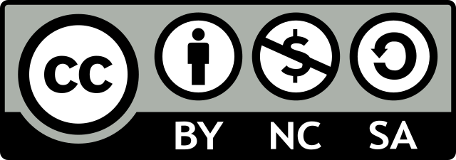

--- 
title: "데이터 과학 프로그래밍"
author: "한국 알(R) 사용자회"
date: "2022-10-17"
site: bookdown::bookdown_site
output:
  bookdown::pdf_document2:
    latex_engine: xelatex
mainfont: NanumGothic
documentclass: book
bibliography: [book.bib, packages.bib]
biblio-style: apalike
link-citations: yes
github-repo: bit2r/book_programming
description: "데이터 과학 프로그래밍 언어"
---

# 기계와의 경쟁 [^joongang-yuval] {-}

기계와의 경쟁에서 인간이 승리할 수 있는 초석이 되고 있는
[소프트웨어 카펜트리(Software Carpentry)](https://software-carpentry.org/) 와
[데이터 카펜트리(Data Carpentry)](https://datacarpentry.org/) 비영리 공공 프로젝트가
많은 영감을 주었고, 특히 2015년 [Python for Informatics: Exploring Information (Korean Edition)](https://www.amazon.com/Python-Informatics-Exploring-Information-Korean/dp/1517143144/)
 한국어 오픈 프로젝트는 새로운 가능성을 보여줬습니다.
2018년부터 **소프트웨어 교육** 이 초중등 교육과정에 의무화되었고, 
알파고가 이세돌을 이긴 **알파고 쇼크** 가 한국사회에 엄청난 파장을 일으켰다. 
그와 더불어 청년, 중장년, 노년 할 것 없이 실업률이 사회적 문제로 대두되면서 기계가 인간의 직업을 빼앗아가는 주범으로 주목되고 있는 한편, **인공지능** 기술을 밑에 깔고 있는 다양한 제품과 서비스가 쏟아지면서 우리의 삶을 그 어느 때보다 풍요롭게 만들고 있다.

컴퓨팅 사고력, 데이터 과학, 인공지능, 로봇/기계를 이해하는 사람과 그렇지 못한 사람간에 삶의 질 차이는 점점더 현격히 벌어질 것이다. 
지금이라도 늦지 않았다. 늦었다는 것을 알아차렸을 때가 가장 빠른 시점이다.

{width=100%}

유발 하라리 교수가 지적했듯이 데이터가 권력과 부의 원천이 되는 세상으로 접어들었는데 이에 대해서 컴퓨터와 적절하게 
의사소통할 수 있는 언어가 필요하다. 
[**R**](http://statkclee.github.io/data-science/ds-r-lang.html)는 일반인에게 많이 알려져 있지 않지만, 
파이썬과 더불어 데이터 프로그래밍에 있어 유구한 역사와 탄탄한 사용자 기반을 가지고 최근들어 혁신적인 변화를 이끌고 있는 언어 중의 하나다. 

> "The future is here, it's just not evenly distributed yet."  
> &nbsp;&nbsp;&nbsp;&nbsp;&nbsp;&nbsp;&nbsp;&nbsp;&nbsp;&nbsp;&nbsp;&nbsp;&nbsp;&nbsp;&nbsp;&nbsp;&nbsp;&nbsp;&nbsp;&nbsp; - William Gibson
> 
> "고대에는 '땅'이 가장 중요했고 땅이 소수에게 집중되자 인간은 귀족과 평민으로 구분됐으며, 
> 근대에는 '기계'가 중요해지면서 기계가 소수에게 집중되자 인간은 자본가와 노동자 계급으로 구분됐다". 
> 이제는 **데이터**가 또 한번 인류를 구분하는 기준이 될 것이다. 
> 향후 데이터가 소수에게 집중되면 단순 계급에 그치는 게 아니라 데이터를 가진 종과 그렇지 못한 종으로 분류될 것이이다. [^joongang-yuval]
> 
> &nbsp;&nbsp;&nbsp;&nbsp;&nbsp;&nbsp;&nbsp;&nbsp;&nbsp;&nbsp;&nbsp;&nbsp;&nbsp;&nbsp;&nbsp;&nbsp;&nbsp;&nbsp;&nbsp;&nbsp; - 유발 하라리(Yuval Noah Harari) 

[^joongang-yuval]: ['사피엔스' 저자 유발 하라리 "인간을 해킹하는 시대가 온다", "머신러닝·AI·생물학 발전…뇌과학 이해도 한층 높여"](http://news.mk.co.kr/newsRead.php?year=2018&no=58432)

---

사단법인 한국 알(R) 사용자회는 디지털 불평등 해소와 통계 대중화를 위해 
2022년 설립되었습니다. 오픈 통계 패키지 개발을 비롯하여
최근에 데이터 사이언스 관련 교재도 함께 제작하여 발간하는 작업을 수행하고 있습니다.
그 첫번째 결과물로 John Fox 교수님이 개발한 설치형 오픈 통계 패키지 `Rcmdr`[@fox2016using] [@rcmdr2022manual] [@rcmdr2005paper] 를 신종화 님께서 한글화 및 문서화에 10년 넘게 기여해주신 한국알사용자회 저작권을 흔쾌히 
허락해 주셔서 [설치형 오픈 통계 패키지 - `Rcmdr`](https://r2bit.com/Rcmdr/)로 세상에 나왔습니다.

두번째 활동을 여기저기 산재되어 있던 시각화 관련 자료를 묶어
**[데이터 시각화(Data Visualization)](https://r2bit.com/book_viz/)**를 전자책 형태로 공개하였고,
데이터 분석 관련 저술을 이어 진행하게 되었습니다.

세번째 활동으로 데이터 사이언스가 하나로 구성되지 않은 것을 간파하고
데이터 사이언스를 지탱하는 기본기술을 5가지로 정리한 
**[데이터 과학을 지탱하는 기본기](https://r2bit.com/book_analytics/)** 전자책을 
공개했습니다.

데이터 분석 언어 R에 관한 지식을 신속히 습득하여 독자들이 갖고 있는 문제에 
접목시키고자 하시는 분은 한국 알(R) 사용자회에서 번역하여 공개한 
[R 신병훈련소(Bootcamp)](https://dl-dashboard.shinyapps.io/rbootcamp/) 과정을
추천드립니다.

---

"데이터 과학 프로그래밍" 저작을 위해 ["Python for Everybody"](https://www.py4e.com/book)와 
[Python for Informatics: Exploring Information](http://www.py4inf.com/)에 기반하여
2015년부터 시작된 [모두를 위한 파이썬](http://aispiration.com/pythonlearn-kr/) 한글화
프로젝트를 기반으로 추진되고 있습니다. "데이터 사이언스 프로그래밍" 저작물을 비롯한 
한국 알(R) 사용자회 저작물은 크리에이티브 커먼즈 
[저작자표시-비영리-동일조건 변경 허락 (BY-NC-SA)](http://ccl.cckorea.org/about/)
라이선스를 준용하고 있습니다. 

  

관련 문의와 연락이 필요한 경우 한국 알(R) 사용자회 admin@r2bit.com 대표전자우편으로 연락주세요.

---

::: {#book-sponsor .rmdtip}
**후원계좌**

디지털 불평등 해소를 위해 제작중인 오픈 통계패키지 개발과 고품질 콘텐츠 제작에 큰 힘이 됩니다.

  - 하나은행 448-910057-06204
  - 사단법인 한국알사용자회
:::

